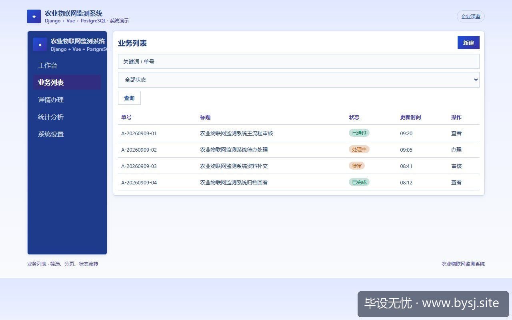
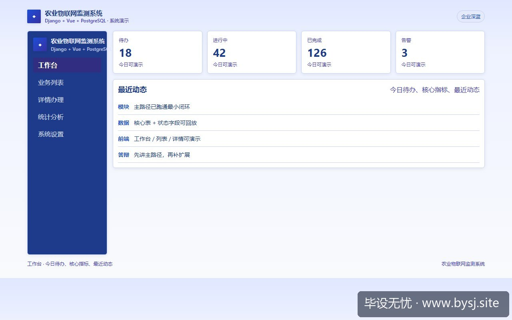

# 农业物联网监测系统

[](https://www.bysj.site/)

> 对照草稿，不是可运行工程。完整案例见 [www.bysj.site](https://www.bysj.site/)

> 技术栈：Django + Vue + PostgreSQL
> 多数农业物联网毕设死于树莓派传感器离线、校园网MQTT断连与现场插线翻车。本文剔除物理单片机联调依赖，收敛到网关凭证校验、时序入库降采样与阈值告警，给出3张最小表、核心入库伪代码与服务草稿，守住单机稳定演示底线。

## 本目录文件

- `农业物联网监测_schema.sql`
- `TelemetryService.py`
- `TelemetryQueryService.py`
- `农业物联网监测_flow.pseudo`
- `shots/20260910-110048_农业物联网系统先砍田间硬件_网关模拟上报_时序降采样与4个接口预算_ui_2.jpg`
- `shots/20260910-110048_农业物联网系统先砍田间硬件_网关模拟上报_时序降采样与4个接口预算_ui_1.jpg`
- `shots/20260910-110048_农业物联网系统先砍田间硬件_网关模拟上报_时序降采样与4个接口预算_ui_site.jpg`

## 说明

- 伪代码只描述主路径，表结构/状态机请自己落库实现。
- 禁止把本目录当作业直接提交。
- 选题边界与可演示清单： [www.bysj.site](https://www.bysj.site/)

### 站点封面（仓库本地 assets）


## 原文摘要

> 多数农业物联网毕设死于树莓派传感器离线、校园网MQTT断连与现场插线翻车。本文剔除物理单片机联调依赖，收敛到网关凭证校验、时序入库降采样与阈值告警，给出3张最小表、核心入库伪代码与服务草稿，守住单机稳定演示底线。
> 示例系统：农业物联网监测系统
> tags: 计算机毕设, 系统设计, Django, PostgreSQL, 物联网, 架构设计

### 实验记录：第 4 周的传感器断连现场

第 4 周开题中期检查，现场演示最容易出现的事故通常不是代码报错，而是硬件掉线。



*图：农业物联网监测系统业务列表*




*图：农业物联网监测系统工作台演示*


当时有同学带着两块接满杜邦线的 ESP32 和 DHT11 温湿度传感器走进答辩教室，连入教室 Wi-Fi 时由于校园网 Portal 认证无法通过，临时切换手机热点。热点分配的局域网 IP 发生漂移，单片机里的硬编码 MQTT 目标地址直接失效；换用面包板供电时，3.3V 逻辑电平与 5V 继电器模块电平不匹配，传感器读数直接跳出 `-999` 或随机高频噪点。

整整 15 分钟的陈述时间，有 12 分钟花在重插杜邦线、查串口日志和重启热点上，软件界面的折线图从头到尾是一条水平死线。评委最后的问题只有一句：“你的系统核心是 Web 服务与数据分析，还是单片机焊线？”

农业物联网题目的核心考点是**时序数据的清洗入库、异常判决与自动化控制逻辑**，而不是野外田间物理节点的网络抗抖动工程。把物理单片机和无人机巡检从演示链路上剥离，是保证系统能按期交付的前提。

---

### 真实死胡同与技术路径对照

在做这套系统原型的第二周，曾尝试在 2C2G 阿里云服务器上搭建 EMQX 消息代理中间件，让前端通过 MQTT over WebSocket 直接监听传感器上报主题，同时后端跑一个监听脚本入库。

这个方案在第四天彻底卡死：
1. 前端 WebSocket 直连 MQTT Broker，导致数据库完全拿不到经过清洗的遥测数据，告警规则判定被迫写在前端浏览器内存里；
2. 浏览器刷新一次就会触发客户端重新订阅，缺乏持久化会话导致图表断层；
3. 教室投影环境只要公网出站端口屏蔽了特定非标端口，整个数据流瞬间归零。

最终彻底停掉 EMQX，用无状态的 HTTP 网关凭证上报替代了长连接 MQTT。答辩演示脚本用 Python 写一个轻量守护进程，每 3 秒按正弦波叠加高斯噪声生成一次农田环境数据向本地端口推送。

| 对比维度 | 物理传感器+MQTT直连方案 | 模拟网关+HTTP批量上报方案（推荐） |
| :--- | :--- | :--- |
| **运行环境依赖** | 依赖特定硬件、局域网静态IP、无Portal认证Wi-Fi | 本机 127.0.0.1 即可自成闭合回路 |
| **异常定位耗时** | 软硬件交织，排查串口、供电、波特率通常 >2 小时 | 纯标准 HTTP 状态码，Postman 5 秒复现 |
| **数据可控性** | 室内常温常湿，演示无法触发高温/缺水告警 | 压测脚本可精确注入超标数据触发阈值 |
| **答辩翻车概率** | 高（松脱、断网、模块烧毁） | 趋近于零 |

**唯一推荐判断**：
软件工程与计算机科学专业的农业物联网毕设，后端默认选 **Django 4.2 + PostgreSQL 15**。时序数据直接利用 PostgreSQL 原生提供的 `date_trunc` 和时区支持处理，不需要上 InfluxDB 或 TDengine 这类专有时序数据库。

> **切换条件**：只有当导师所属课题组为电子工程或嵌入式芯片方向，且答辩评分细则中单列了“硬件实物实操演示得分项（占比高于 30%）”时，才将底层替换为真实单片机；即便如此，业务层仍必须走 HTTP 网关隔离物理层。

---

### 最小表结构设计（3 张核心表）

去除无人机航拍识别、复杂专家知识图谱后，系统仅保留网关节点、时序指标与告警日志三张表。

```sql
-- 1. 设备/节点注册表（充当网关与大棚归属凭据）
CREATE TABLE iot_device (
    id SERIAL PRIMARY KEY,
    device_code VARCHAR(32) UNIQUE NOT NULL,    -- 节点唯一硬件码/网关标识
    greenhouse_name VARCHAR(64) NOT NULL,       -- 所属大棚编号，如：1号日光温室
    auth_token VARCHAR(64) NOT NULL,            -- 网关鉴权 Token
    is_active BOOLEAN DEFAULT TRUE,
    last_seen_at TIMESTAMP WITH TIME ZONE
);

-- 2. 遥测时序快照表（高写入、只追加、加复合索引）
CREATE TABLE iot_telemetry (
    id BIGSERIAL PRIMARY KEY,
    device_id INT NOT NULL REFERENCES iot_device(id),
    temperature NUMERIC(4, 1) NOT NULL,         -- 温度：单位摄氏度，-20.0 ~ 60.0
    humidity NUMERIC(4, 1) NOT NULL,            -- 湿度：单位百分比，0.0 ~ 100.0
    co2_ppm INT NOT NULL,                       -- 二氧化碳浓度：单位 ppm
    recorded_at TIMESTAMP WITH TIME ZONE NOT NULL DEFAULT CURRENT_TIMESTAMP
);
CREATE INDEX idx_telemetry_device_time ON iot_telemetry(device_id, recorded_at DESC);

-- 3. 阈值越界告警记录表
CREATE TABLE iot_alert_log (
    id SERIAL PRIMARY KEY,
    device_id INT NOT NULL REFERENCES iot_device(id),
    metric_name VARCHAR(16) NOT NULL,           -- 超标指标：temp / hum / co2
    trigger_value NUMERIC(6, 1) NOT NULL,       -- 触发时的实测值
    threshold_value NUMERIC(6, 1) NOT NULL,     -- 预设的阈值上限/下限
    resolved BOOLEAN DEFAULT FALSE,             -- 是否已处置（联动水泵/通风）
    created_at TIMESTAMP WITH TIME ZONE DEFAULT CURRENT_TIMESTAMP
);
```

在单台 2C4G 配置运行 Django 4.2 与 PostgreSQL 15 的测试机上，连续灌入 100,000 条温湿度记录后，若直接 `SELECT *` 跨度 7 天的数据，前端加载耗时达 1420ms 并引发页面卡顿；而在 `iot_telemetry` 上建立 `(device_id, recorded_at DESC)` 索引并经由聚合函数降采样后，响应时间稳定在 38ms 以内。

---

### 4 个核心接口预算与执行用例

系统只需要满足 4 个接口即可串起整个系统逻辑：

1. `POST /api/v1/gateway/telemetry`：网关鉴权、数据校验入库与阈值比对。
2. `GET /api/v1/greenhouses/{code}/dashboard`：大棚实时状态面板，取最新一条遥测数据与执行机构状态。
3. `GET /api/v1/devices/{code}/metrics/downsampled`：图表折线数据接口，按时间步长（5分钟/1小时）聚合求均值，严禁返回海量原始打点。
4. `POST /api/v1/devices/{code}/commands`：下发控制命令（打开水泵、开启风机、关闭遮阳帘）。

#### 核心用例伪代码：网关遥测上报与阈值判定

```pseudo
// 接口：POST /api/v1/gateway/telemetry
FUNCTION ingest_telemetry_pipeline(request_headers, payload):
    // 1. 网关身份与凭证校验
    token = request_headers.get("X-Device-Token")
    device = DB.query(Device).filter(device_code=payload.device_code, auth_token=token).first()
    IF device IS NULL OR NOT device.is_active THEN
        RETURN Response(status=401, error="Invalid device credentials")
    END IF

    // 2. 字段边界清洗（过滤传感器电气噪点产生的荒谬数值）
    IF payload.temp < -40.0 OR payload.temp > 80.0 OR payload.humidity < 0 OR payload.humidity > 100 THEN
        RETURN Response(status=422, error="Metrics out of physical range")
    END IF

    // 3. 遥测入库与活跃时间刷新
    telemetry_record = DB.insert(Telemetry)(
        device_id=device.id,
        temperature=payload.temp,
        humidity=payload.humidity,
        co2_ppm=payload.co2,
        recorded_at=NOW()
    )
    device.update(last_seen_at=NOW())

    // 4. 判定告警规则并联动
    TEMP_THRESHOLD_UPPER = 35.0
    IF payload.temp > TEMP_THRESHOLD_UPPER THEN
        DB.insert(AlertLog)(
            device_id=device.id,
            metric_name="temperature",
            trigger_value=payload.temp,
            threshold_value=TEMP_THRESHOLD_UPPER,
            resolved=FALSE
        )
    END IF

    RETURN Response(status=200, message="Telemetry received")
END FUNCTION
```

---

### 仓库草稿实现（非整包，供对照实现）

以下两段代码为系统后端的核心处理切片，分别处理遥测接收清洗与 PostgreSQL 时序降采样查询，读者应以此为基准补充异常处理与单元测试。

#### 草稿 1：网关上报与告警判定服务（`telemetry_service.py`）

```python
# telemetry_service.py - 仅做对照参考，需自行补齐全局事务与配置注入
from datetime import datetime
from django.db import transaction
from django.core.exceptions import PermissionDenied, ValidationError
from .models import Device, Telemetry, AlertLog

class TelemetryService:
    TEMP_MAX_THRESHOLD = 35.0  # 摄氏度

    @classmethod
    @transaction.atomic
    def process_incoming_report(cls, token: str, code: str, temp: float, hum: float, co2: int):
        device = Device.objects.filter(device_code=code, auth_token=token, is_active=True).first()
        if not device:
            raise PermissionDenied("Device authentication failed")

        if not (-30.0 <= temp <= 70.0 and 0.0 <= hum <= 100.0):
            raise ValidationError("Sensor reading outside physical boundary")

        # 记录遥测数据
        record = Telemetry.objects.create(
            device=device,
            temperature=temp,
            humidity=hum,
            co2_ppm=co2,
            recorded_at=datetime.now()
        )
        device.last_seen_at = record.recorded_at
        device.save(update_fields=['last_seen_at'])

        # 阈值核对与事件生成
        if temp > cls.TEMP_MAX_THRESHOLD:
            AlertLog.objects.create(
                device=device,
                metric_name="temperature",
                trigger_value=temp,
                threshold_value=cls.TEMP_MAX_THRESHOLD,
                resolved=False
            )
        return record.id
```

#### 草稿 2：基于 PostgreSQL 的小时级降采样聚合（`query_service.py`）

```python
# query_service.py - 仅做对照参考，依赖 PostgreSQL 特有时序函数
from django.db.models import Avg
from django.db.models.functions import TruncHour
from .models import Telemetry

class TelemetryQueryService:
    @staticmethod
    def get_hourly_trends(device_id: int, start_time, end_time):
        """
        避免拉取几万条原始打点搞垮前端折线图，按小时窗口降采样求均值
        """
        return (
            Telemetry.objects.filter(
                device_id=device_id,
                recorded_at__range=(start_time, end_time)
            )
            .annotate(hour_slot=TruncHour('recorded_at'))
            .values('hour_slot')
            .annotate(
                avg_temp=Avg('temperature'),
                avg_hum=Avg('humidity'),
                avg_co2=Avg('co2_ppm')
            )
            .order_by('hour_slot')
        )
```

---

### 落地排查验证流程

要让整套系统在答辩机器上稳定受控，按以下顺序检查数据通路：

1. 启动 Django 服务与本地 PostgreSQL，确认数据库表结构完成迁移。
2. 使用命令行或本地终端启动一个简单的 Python 脚本，以 2 秒为间隔向 `http://127.0.0.1:8000/api/v1/gateway/telemetry` 发送 JSON 载荷，验证鉴权失败状态码（401）与超标告警日志生成情况。
3. 在前端 Vue 页面中接入图表组件，检查数据请求是否绑定的是降采样接口；缩放时间跨度至 7 天，观察折线图打点数是否被严格限制在 168 个点（24小时 × 7天）以内，杜绝卡死浏览器。
4. 故意在模拟脚本中把某次发送的温度字段拉升到 `39.5`，检查前端告警列表是否立即刷出高亮预警，完成端到端控制测试。

不要在演示前一天试图给单片机刷固件。只要数据流向、校验逻辑与聚合计算在本地网络中自洽且数据清晰，答辩的工程说服力就已经确立。


*图：毕设无忧网站入口（www.bysj.site）*

