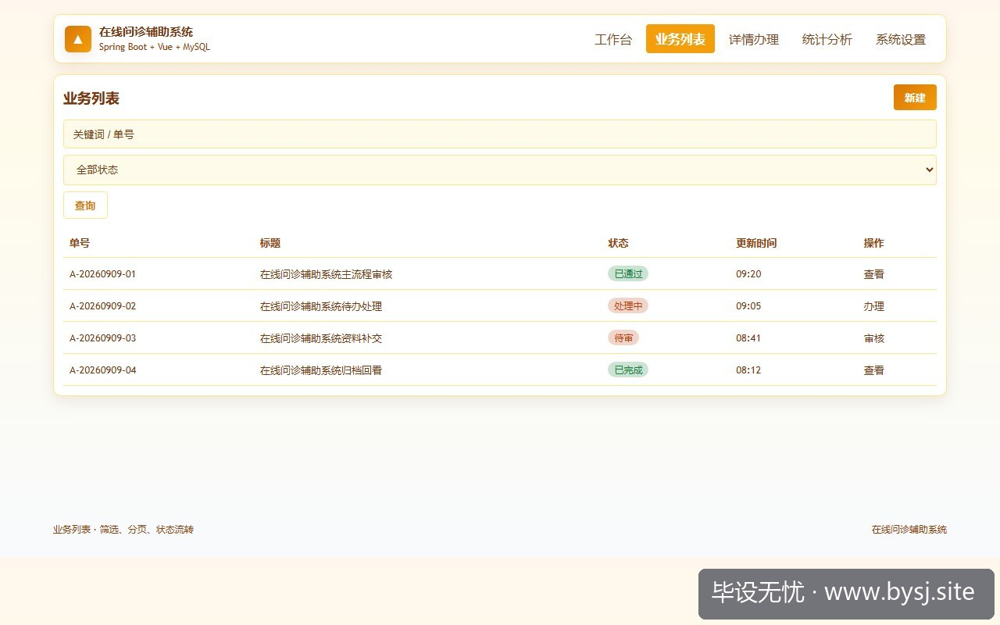
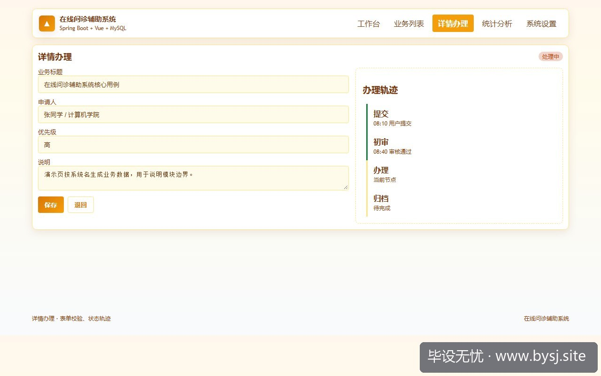
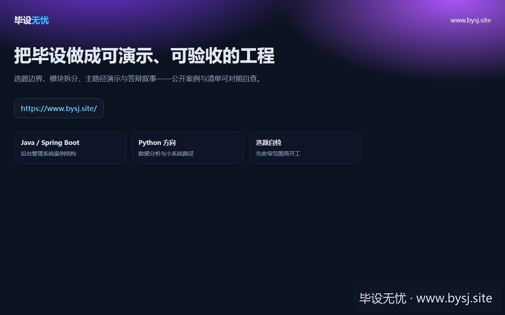

# 在线问诊辅助系统

[](https://www.bysj.site/)

> 对照草稿，不是可运行工程。完整案例见 [www.bysj.site](https://www.bysj.site/)

> 技术栈：Spring Boot + Vue + MySQL
> 在线问诊题目容易滑向AI诊断、视频问诊和支付链路，最终难以验收。本文用角色、状态和数据边界收敛系统，给出最小表结构、页面、伪代码与Spring Boot草稿。

## 本目录文件

- `在线问诊辅助_flow.pseudo`
- `shots/20260926-102207_在线问诊辅助系统先砍掉诊断与实时通信_Spring_Boot_单库接口预算_ui_1.jpg`
- `shots/20260926-102207_在线问诊辅助系统先砍掉诊断与实时通信_Spring_Boot_单库接口预算_ui_2.jpg`
- `shots/20260926-102207_在线问诊辅助系统先砍掉诊断与实时通信_Spring_Boot_单库接口预算_ui_3.jpg`
- `shots/20260926-102207_在线问诊辅助系统先砍掉诊断与实时通信_Spring_Boot_单库接口预算_ui_site.jpg`

## 说明

- 伪代码只描述主路径，表结构/状态机请自己落库实现。
- 禁止把本目录当作业直接提交。
- 选题边界与可演示清单： [www.bysj.site](https://www.bysj.site/)

### 站点封面（仓库本地 assets）


## 原文摘要

> 在线问诊题目容易滑向AI诊断、视频问诊和支付链路，最终难以验收。本文用角色、状态和数据边界收敛系统，给出最小表结构、页面、伪代码与Spring Boot草稿。
> 示例系统：在线问诊辅助系统
> tags: 毕业设计, 课程设计, Spring Boot, Vue, MySQL, 在线问诊系统, 系统设计

“患者提交症状，医生在线回复，系统还能给出诊断建议。”开题时这句话听起来完整，到了第3周却出现三个空洞：没有真实医生账号，没有可验证的诊断模型，图片和视频也没有稳定存储方案。老师继续追问：“如果建议错了，系统承担什么角色？”这时才发现，题目已经从信息管理系统滑向医疗产品。

本文只讨论一个具体对象：**在线问诊辅助系统**。它的边界不是自动诊断，而是把患者咨询、医生审核、回复留痕和基础分诊提示组织成一条可演示链路。默认技术栈只选 **Spring Boot + Vue + MySQL**，先保证本地单机环境能从登录走到问诊结果。

## 先把“问诊”改成可验收的业务动作


*图：在线问诊辅助系统工作台演示*


建议将系统角色限定为患者、医生、管理员。患者填写症状描述和就诊科室，医生查看待处理咨询并回复，管理员维护科室与账号状态。系统可以根据患者选择的症状标签给出“建议就诊科室”，但不输出疾病结论，也不替代医生审核。

| 需求写法 | 可行性判断 | 是否进入首版 | 原因 |
|---|---|---:|---|
| 患者提交图文咨询 | 可做 | 是 | 文本和图片路径可在单库管理 |
| 医生审核并回复 | 可做 | 是 | 状态流转清晰，容易截图验收 |
| 症状关键词匹配科室 | 可做但有限 | 是 | 用规则表解释结果，不依赖模型训练 |
| AI自动诊断 | 高风险 | 否 | 数据集、准确率和责任边界都难证明 |
| 实时视频问诊 | 工程量偏大 | 否 | 需要WebRTC、信令与网络环境 |
| 在线支付与处方流转 | 不建议 | 否 | 涉及第三方接口、合规和业务资质 |

这里给出一个可反驳的判断：**本科毕设首版不应该把“智能诊断”放进主链路。**如果你已经有经过授权的脱敏问诊数据、明确的分类指标，并且导师熟悉模型评估，那么可以把分类模型作为独立实验页接入；否则，规则化分诊更适合答辩，因为输入、规则和输出都能被复现。

## 先试过模型，为什么后来停了



*图：在线问诊辅助系统业务列表*


最初的尝试是把患者文本直接送进一个分类模型，让它预测“内科、外科、皮肤科”。问题不在接口怎么调，而在样本怎么解释：同一句“胸闷”，可能来自呼吸系统、心血管或情绪因素。用十几条手写样本测试，准确率没有统计意义；用公开数据替代，又无法证明与本系统场景一致。

这条路停在“无法向老师解释训练数据和错误责任”，不是因为模型代码写不出来。后续直接跳过在线诊断，把症状标签、科室和提示语放进规则表，并在页面显示“仅作分诊参考”。意外的是，答辩演示中更容易被追问的不是匹配算法，而是医生能不能修改患者提交内容、管理员能不能越权查看咨询记录。角色权限比关键词规则更先翻车。

## 四个模块足够支撑一条演示链



*图：在线问诊辅助系统详情办理*


### 患者端：提交和查看

患者登录后选择科室、勾选症状标签、填写描述，可上传一张辅助图片。提交成功后状态为 `PENDING`，详情页展示提交时间、当前状态和医生回复。首版不做聊天窗口，回复采用一次提交一次审核的形式。

### 医生端：审核和回复

医生只查看分配给自己科室的待处理记录。点击“接诊”后状态改为 `PROCESSING`，填写回复并提交，状态进入 `REPLIED`。医生不能修改患者原始描述，只能追加回复；这样数据库审计也更简单。

### 分诊规则：解释提示，不做诊断

规则表使用症状标签匹配科室。命中多个科室时按照优先级取一条，并展示命中的标签，例如“根据‘皮疹、瘙痒’建议选择皮肤科”。没有命中时显示“请由医生人工判断”，不返回疾病名称。

### 管理端：维护可用数据

管理员维护用户启用状态、科室名称和症状标签。首版不加入复杂组织架构，医生直接绑定一个科室。这样既能完成权限演示，也能避免“医院—院区—科室—医生组”的层级扩张。

## 核心表先按字段算，不按页面堆

| 表名 | 关键字段 | 用途 |
|---|---|---|
| `sys_user` | `id, username, password_hash, role, dept_id, status` | 账号、角色和医生科室 |
| `department` | `id, name, enabled` | 可选问诊科室 |
| `symptom_tag` | `id, name, dept_id, priority, enabled` | 分诊规则的输入项 |
| `consultation` | `id, patient_id, doctor_id, dept_id, content, image_url, status, created_at` | 一次问诊主记录 |
| `consultation_tag` | `consultation_id, tag_id` | 问诊与症状标签的关联 |
| `consultation_reply` | `id, consultation_id, doctor_id, content, created_at` | 医生回复与留痕 |

这套结构的关键是把患者原文和医生回复分开。若把回复直接写回 `consultation.content`，页面看似简单，后续却无法说明谁改了内容，也无法展示审核过程。预计演示数据控制在 50～200 条问诊记录时，MySQL 单库查询足够；只有当出现多机构隔离、日请求量持续超过单机压测结果，才考虑拆服务或引入缓存。

## 页面和接口要与截图一一对应

建议只做以下页面：登录页、患者提交页、我的问诊页、医生待处理页、问诊详情页、管理员字典维护页。每个页面最好对应一个可解释的接口，而不是先把菜单做满。

1. `POST /api/auth/login`：校验账号、角色和启用状态。
2. `POST /api/consultations`：患者创建问诊及标签关联。
3. `GET /api/consultations/my`：患者查询自己的记录。
4. `GET /api/doctor/consultations?status=PENDING`：医生按科室查询待处理记录。
5. `POST /api/consultations/{id}/accept`：医生接诊并锁定处理人。
6. `POST /api/consultations/{id}/reply`：医生写入回复并完成状态变更。
7. `GET /api/departments`：加载可用科室和分诊标签。

唯一推荐的实现顺序是：**先完成登录、创建、审核、查询四个接口，再做规则提示和管理页面。**不推荐一开始接Redis、MQ或第三方医疗API。若后续切换条件成立，例如需要多实例部署、异步通知量超过本地线程池承受范围，或者导师明确要求分布式设计，再单独增加组件，并保留单体版本作为演示基线。

## 创建问诊时，事务边界比算法更值得展示

下面是核心用例伪代码，展示患者创建问诊、保存标签和生成分诊提示的关系。它是示意草稿，不是完整可运行工程；参数校验、登录态和异常类需要读者自己实现。

```text
伪代码：创建问诊（示意，不可直接运行）
输入 patientId, deptId, content, imageUrl, tagIds
1. 校验患者账号处于启用状态
2. 校验 deptId 存在且 enabled = true
3. 校验 content 长度在 10～2000 字符
4. 查询 tagIds，确认全部属于有效标签
5. 开启数据库事务
6. 插入 consultation，status = PENDING
7. 批量插入 consultation_tag
8. 按标签 priority 选择分诊提示
9. 更新 consultation.triage_hint
10. 提交事务并返回 consultationId
失败：任一步异常则回滚问诊主表与标签表
```

这里的数字只适用于本地演示约束：例如 10～2000 字符是表单校验示例，不是医疗标准。图片建议只保存文件路径和原始文件名，演示环境限制为单张、5MB以内；如果学校服务器没有对象存储，就不要把上传链路写成核心创新点。

## Service 草稿：只留下可讲清楚的事务

```java
// ConsultationService.java（示意，不可直接运行）
@Transactional
public Long create(CreateConsultationCmd cmd, Long patientId) {
    userChecker.requirePatientEnabled(patientId);
    departmentChecker.requireEnabled(cmd.deptId());

    List<SymptomTag> tags = tagMapper.findEnabledByIds(cmd.tagIds());
    if (tags.size() != cmd.tagIds().size()) {
        throw new BizException("存在无效症状标签");
    }

    Consultation entity = Consultation.pending(
        patientId, cmd.deptId(), cmd.content(), cmd.imageUrl());
    consultationMapper.insert(entity);
    tagMapper.batchBind(entity.getId(), cmd.tagIds());

    String hint = triageRuleService.buildHint(tags);
    consultationMapper.updateHint(entity.getId(), hint);
    return entity.getId();
}
```

这段草稿没有处理所有边界，例如重复提交、医生接诊并发和图片安全检查。首版可以用前端按钮禁用加服务端状态判断防止明显重复；医生接诊时必须带上 `where id = ? and status = 'PENDING'`，更新结果为 0 就提示记录已被处理。

## 失败点要提前写进答辩说明

- **把医生回复写成覆盖更新**：后续无法说明历史记录，改为独立的 `consultation_reply` 表。
- **按患者输入的科室直接查询医生**：患者可以随意选择，无法体现规则作用；分诊提示只能作为参考，接诊仍由医生科室过滤。
- **把“辅助”说成“诊断”**：这是表述和责任边界的翻车点。页面统一使用“建议科室”“医生回复”“仅供参考”。
- **默认管理员能看全部敏感内容**：演示时需要说明权限；管理员只维护字典，患者详情和医生回复按角色限制。

可行性评估最终落在四个问题：有没有可造的数据、有没有能截图的状态变化、有没有能解释的规则、有没有必须依赖外部机构的接口。在线问诊辅助系统适合做成单体管理系统，前提是把“医疗判断”排除在首版目标外。真正需要继续核实的是学校对健康数据示例和图片素材的使用要求，这部分不能用技术实现替代合规说明。



*图：毕设无忧网站入口（www.bysj.site）*

