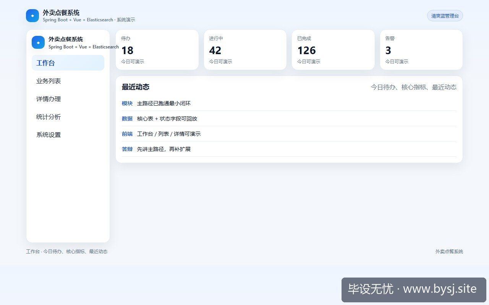
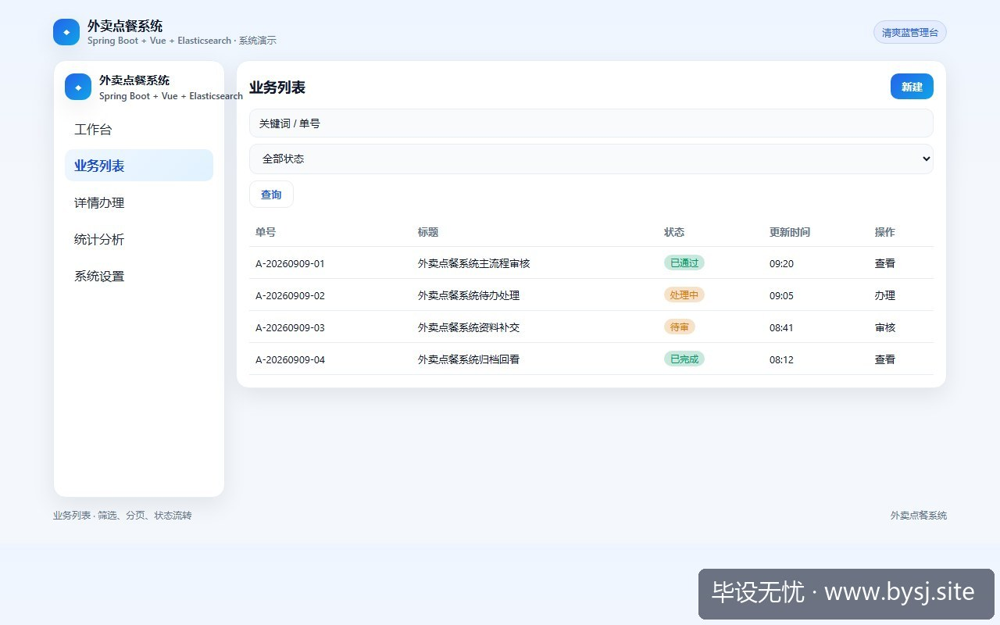
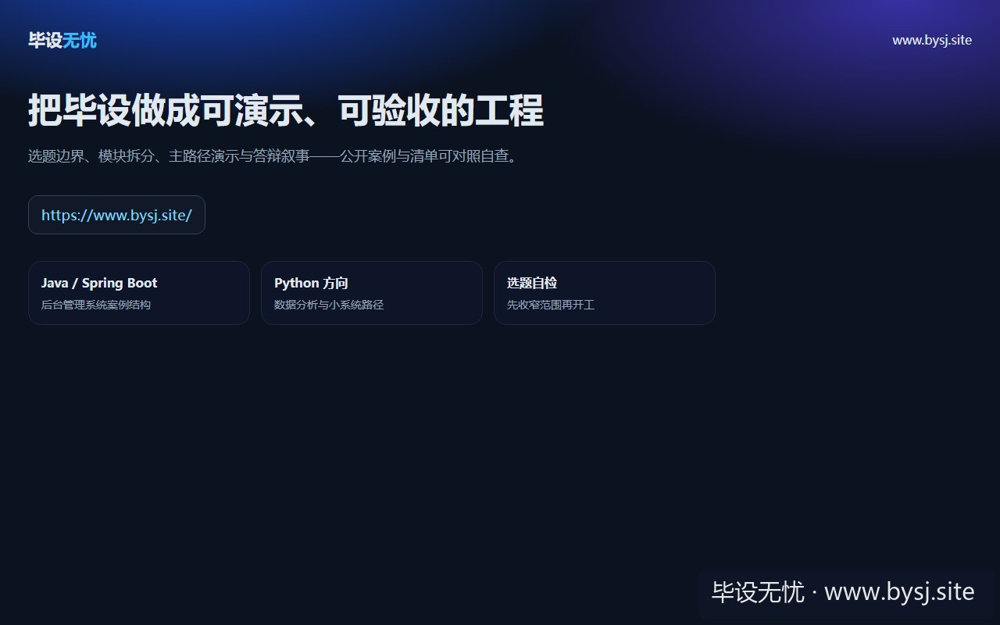

# 外卖点餐系统

[](https://www.bysj.site/)

> 对照草稿，不是可运行工程。完整案例见 [www.bysj.site](https://www.bysj.site/)

> 技术栈：Spring Boot + Vue + Elasticsearch
> 外卖毕设常卡在支付、骑手定位和搜索联调。本文用商家审核、价格快照、订单状态三条证据链收缩范围，给出可演示的表结构与实现草稿。

## 本目录文件

- `外卖点餐_schema.sql`
- `OrderService.java`
- `DishSearchMapper.py`
- `外卖点餐_flow.pseudo`
- `shots/20260926-110200_外卖点餐系统把可行性钉在订单快照_模块边界_最小表与审核流程_ui_1.jpg`
- `shots/20260926-110200_外卖点餐系统把可行性钉在订单快照_模块边界_最小表与审核流程_ui_2.jpg`
- `shots/20260926-110200_外卖点餐系统把可行性钉在订单快照_模块边界_最小表与审核流程_ui_site.jpg`

## 说明

- 伪代码只描述主路径，表结构/状态机请自己落库实现。
- 禁止把本目录当作业直接提交。
- 选题边界与可演示清单： [www.bysj.site](https://www.bysj.site/)

### 站点封面（仓库本地 assets）


## 原文摘要

> 外卖毕设常卡在支付、骑手定位和搜索联调。本文用商家审核、价格快照、订单状态三条证据链收缩范围，给出可演示的表结构与实现草稿。
> 示例系统：外卖点餐系统
> tags: 计算机毕设, 外卖点餐系统, Spring Boot, Vue, Elasticsearch, 系统设计, 伪代码

## 第六周答辩：老师先问订单怎么证明



*图：外卖点餐系统工作台演示*


“用户看到的 18 元套餐，结算时为什么变成 22 元？”老师没有先问你用了什么框架，而是直接点开订单详情。此时如果订单只保存了 `dish_id` 和当前菜品价格，系统就无法解释历史金额；如果商家审核、菜品上下架、订单状态都靠前端控制，演示时一次刷新就可能出现“已取消还能发货”。

因此，这个外卖点餐系统不先从搜索页面开始，而先确定一条能被复查的证据链：商家是否通过审核，菜品当时卖什么价格，订单经历了哪些状态。搜索只是帮助用户找到菜品，不能成为订单事实来源。

本文把系统限定为校园场景：学生在网页端选择餐品，商家后台维护菜单，管理员审核商家，订单由商家手动确认和完成。暂不接真实支付、骑手定位、地图路径和短信网关。这样做不是把系统做空，而是把每个核心动作都留出可展示的数据证据。

## 先做一次边界对照，而不是先建前端目录



*图：外卖点餐系统业务列表*


| 方案 | 可行性 | 数据准备 | 导师熟悉度 | 演示风险 | 判断 |
|---|---|---|---|---|---|
| 商家审核、菜品管理、下单、订单状态 | 高 | 本地种子数据即可 | 高 | 低 | 推荐 |
| 加真实支付、骑手抢单、实时地图 | 低 | 需要第三方资质和持续联调 | 中 | 高 | 不纳入首版 |
| 只做菜单展示与购物车 | 中 | 简单 | 高 | 低 | 论文证据不足 |
| 先做 ES 推荐和销量预测 | 中低 | 需要较长订单历史 | 低 | 中高 | 后置 |

唯一推荐的默认栈是 Spring Boot + Vue + MySQL + Elasticsearch。MySQL保存业务事实，Elasticsearch保存可重建的搜索索引；订单价格、菜品名称和折扣快照不能从 ES 反查。运行环境按单机开发机估算，样例数据控制在 2000 个菜品、100 个商家、每天 1000 笔模拟订单以内，这个规模足够展示分页、搜索和状态流转，也不需要 Redis、消息队列或微服务。

只有在两个条件同时成立时才切换方案：数据量超过 10 万条菜品，且确实需要分词、拼音或多字段排序。否则直接使用 MySQL 的索引查询更稳。若学校明确要求支付联调，再单独接沙箱支付；没有沙箱账号时，不应把真实支付写成系统已完成的能力。

## 失败记录：把 Elasticsearch 当成订单查询源

最初的错误设计是：用户从 ES 搜到菜品后，前端把搜索结果里的价格直接提交给订单接口。看起来调用链很短，实际很快出现了反例。商家修改菜品价格后，ES 索引还没有刷新，用户提交的金额和 MySQL 当前价格不一致；更糟的是，前端可以修改请求中的 `unitPrice`，订单金额就被篡改。

这条路在本地测试时不一定马上失败，因为测试数据少、刷新及时。停下来检查后，结论很明确：搜索结果只能携带菜品编号，订单服务必须重新读取 MySQL 中的可售菜品和当前价格，并在订单明细里写入快照。之后即使菜品改名、下架，旧订单仍然能复原。

可反驳的判断是：本科毕设不需要把价格快照做得这么细。如果系统只是静态展示、没有真实下单和历史订单查询，这个判断成立；但只要答辩要演示“修改菜品后旧订单不变”，快照就从加分项变成了基础约束。

## 模块预算：只保留四条可验收链路

1. **账号与角色**：学生、商家、管理员三种角色。登录后只做接口级权限判断，不做复杂组织架构。
2. **商家与菜品**：管理员审核商家；审核通过后商家才能创建菜品。菜品状态只保留 `ON_SALE`、`OFF_SALE`、`DELETED`。
3. **购物车与订单**：购物车可以放在前端，但提交订单时必须重新校验菜品状态、价格和数量。订单明细保存名称、单价、数量、优惠后金额。
4. **商家处理与查询**：商家按状态查看订单，执行“待支付模拟完成—已接单—制作中—已完成”流程。管理员可按商家、日期和状态查询。

最小接口预算控制在 10 个以内：商家审核 1 个、菜品增改查 3 个、搜索 1 个、创建订单 1 个、订单列表 2 个、状态更新 2 个。优惠券、满减叠加、配送费动态计算都不进入第一版。

## 最小表结构：历史事实必须脱离当前菜品

```sql
-- 示意结构，不是可直接运行的完整建库脚本
user_account(id, username, password_hash, role, status, created_at)
merchant(id, name, audit_status, address, created_at)
dish(id, merchant_id, name, description, price, stock, sale_status, version)
orders(id, user_id, merchant_id, total_amount, status, created_at)
order_item(id, order_id, dish_id, dish_name_snapshot, unit_price_snapshot,
           quantity, line_amount)
order_status_log(id, order_id, from_status, to_status, operator_id, created_at)
```

`dish.version`用于处理后台修改冲突，`order_item`负责保存下单瞬间的名称和价格，`order_status_log`则提供答辩时可展示的状态证据。金额建议使用 `DECIMAL(10,2)`，不要用浮点数相加。库存若只是展示，可在创建订单时做一次扣减；如果要证明并发安全，需要再增加库存流水和事务测试，这属于范围扩大信号。

## 创建订单：先验证，再生成不可变明细

下面是核心用例伪代码。它描述的是服务层行为，不是完整工程；事务、异常类、权限注解和参数校验仍需自行实现。

```text
// 示意伪代码：创建订单，不可直接运行
function createOrder(userId, cartItems):
    require cartItems is not empty
    begin transaction

    grouped = groupByMerchant(cartItems)
    if grouped.size != 1:
        reject("首版只允许同一商家下单")

    merchantId = grouped.first.merchantId
    merchant = merchantRepo.find(merchantId)
    require merchant.auditStatus == APPROVED

    order = new Order(userId, merchantId, PENDING_PAY)
    for item in cartItems:
        dish = dishRepo.findForUpdate(item.dishId)
        require dish.merchantId == merchantId
        require dish.saleStatus == ON_SALE
        require dish.stock >= item.quantity

        line = item.quantity * dish.price
        order.addItem(dish.id, dish.name, dish.price, item.quantity, line)
        dish.stock -= item.quantity
        dishRepo.update(dish)

    order.totalAmount = order.sumLines()
    orderRepo.insert(order)
    statusLogRepo.append(null, PENDING_PAY, userId)
    commit
    return order.id
```

这里有一个明确取舍：首版只允许同一商家下单。多商家合单会引入拆单、分别配送、部分取消和多笔结算，不适合在没有真实配送规则的情况下硬塞进系统。只有当论文题目明确要求平台级多商家结算，才应把订单拆分模型单独设计。

## `OrderService.java`：只展示事务边界

```java
// 对照草稿：方法签名和校验顺序需自行补全，不是完整工程
@Service
public class OrderService {
    @Transactional
    public Long create(Long userId, List<CartItemCmd> items) {
        if (items == null || items.isEmpty()) {
            throw new BizException("购物车为空");
        }
        Long merchantId = cartValidator.onlyOneMerchant(items);
        merchantGuard.requireApproved(merchantId);

        Order order = Order.pending(userId, merchantId);
        for (CartItemCmd cmd : items) {
            Dish dish = dishMapper.selectForUpdate(cmd.dishId());
            dishGuard.checkSellable(dish, merchantId, cmd.quantity());
            order.addSnapshot(dish.getId(), dish.getName(),
                    dish.getPrice(), cmd.quantity());
            dishMapper.decreaseStock(dish.getId(), cmd.quantity());
        }
        orderMapper.insert(order);
        statusLogMapper.insertCreated(order.getId(), userId);
        return order.getId();
    }
}
```

`selectForUpdate`只有在事务和合适的数据库引擎下才有意义，不能把它当成万能并发方案。课程设计阶段可先用单机事务完成演示；如果要声称支持高并发，应补充压测条件、数据库隔离级别和失败回滚结果，不能只在论文里写“保证一致性”。

## `DishSearchMapper.py`：搜索索引只做检索

```python
# 对照草稿：示意查询，不保证可直接运行
class DishSearchMapper:
    def search(self, keyword, merchant_id=None, page=1, size=10):
        body = {
            "query": {"bool": {"must": [
                {"match": {"name": keyword}},
                {"term": {"sale_status": "ON_SALE"}}
            ]},
            "from": (page - 1) * size,
            "size": size
        }
        if merchant_id:
            body["query"]["bool"]["filter"] = [
                {"term": {"merchant_id": merchant_id}}
            ]
        return self.client.search(index="dish_read", body=body)
```

索引更新失败时，后台仍应能从 MySQL 查询和修改菜品；搜索短暂落后可以被记录为同步异常，但不能阻断商家审核和订单创建。答辩演示时可准备一条“修改菜品价格后重建索引”的操作，说明读模型和业务真源之间的关系。

## 最后验收：看四个动作能否互相解释

1. 管理员审核商家，未通过的商家不能发布可售菜品。
2. 学生搜索菜品并提交订单，服务端重新读取价格，不接受前端金额。
3. 商家修改菜品价格，旧订单的快照金额保持不变。
4. 商家推进订单状态，非法跳转被拒绝，状态日志能展示操作者和时间。

如果这四个动作在本地单机环境下都能复现，系统就有了可行的答辩主线。真正需要警惕的不是少接一个支付接口，而是订单无法解释、状态无法追踪、搜索结果被误当成业务事实。外卖点餐系统的技术难点可以后置，先把这条证据链做成可检查的结果。



*图：毕设无忧网站入口（www.bysj.site）*

