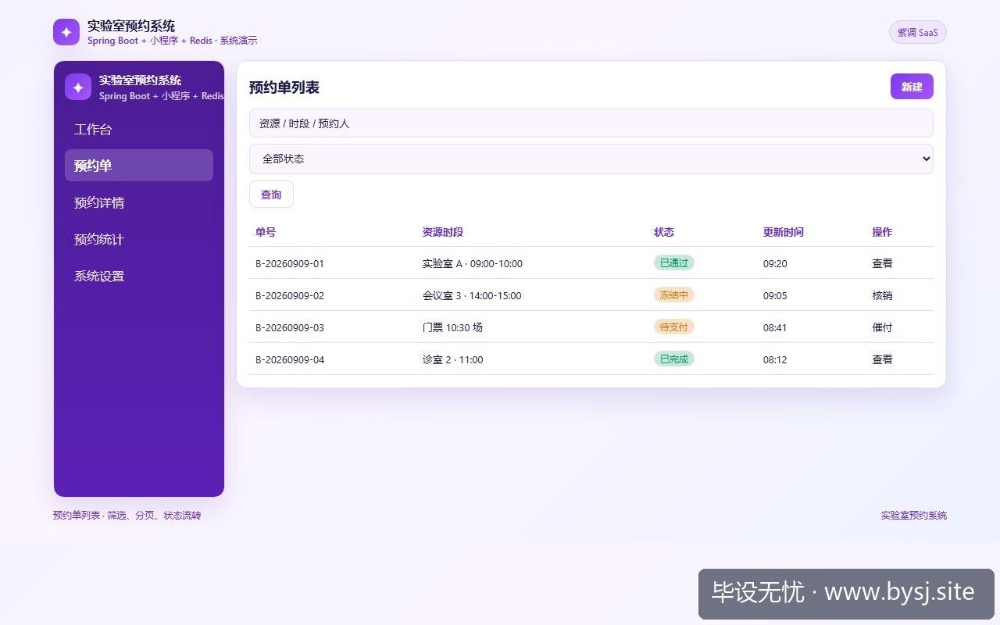
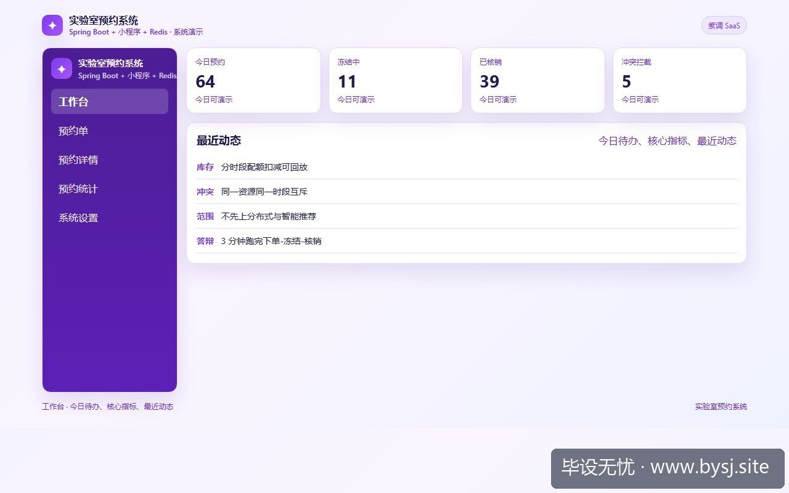

# 实验室预约系统

[](https://www.bysj.site/)

> 对照草稿，不是可运行工程。完整案例见 [www.bysj.site](https://www.bysj.site/)

> 技术栈：Spring Boot + 小程序 + Redis
> 多数实验室预约毕设卡在人脸门禁硬件联调与跨天排期死锁。本文砍掉实体门禁与动态排队，收敛到台位时段唯一性与违约计次，给出最小表结构与防重占用伪代码，单人本地稳定演示。

## 本目录文件

- `实验室预约_schema.sql`
- `LabReservationService.java`
- `ReservationCheckTask.java`
- `实验室预约_flow.pseudo`
- `shots/20260911-110033_实验室预约选题别碰人脸门禁_台位时段锁与违约记次的收敛笔记_ui_2.jpg`
- `shots/20260911-110033_实验室预约选题别碰人脸门禁_台位时段锁与违约记次的收敛笔记_ui_1.jpg`
- `shots/20260911-110033_实验室预约选题别碰人脸门禁_台位时段锁与违约记次的收敛笔记_ui_site.jpg`

## 说明

- 伪代码只描述主路径，表结构/状态机请自己落库实现。
- 禁止把本目录当作业直接提交。
- 选题边界与可演示清单： [www.bysj.site](https://www.bysj.site/)

### 站点封面（仓库本地 assets）


## 原文摘要

> 多数实验室预约毕设卡在人脸门禁硬件联调与跨天排期死锁。本文砍掉实体门禁与动态排队，收敛到台位时段唯一性与违约计次，给出最小表结构与防重占用伪代码，单人本地稳定演示。
> 示例系统：实验室预约系统
> tags: 毕业设计, 实验室预约, SpringBoot, 系统设计, 伪代码

### 开题现场：第 3 周的人脸门禁卡在寝室桌角

开题答辩时写着「基于深度学习人脸识别的高校实验室智能门禁与预约系统」，到第 3 周桌上堆着买来的 ESP32-CAM 和 5V 继电器，连着寝室 Wi-Fi 疯狂报 `Connection reset by peer`。



*图：实验室预约系统预约单列表*




*图：实验室预约系统工作台演示*


物理门禁硬件在答辩演示时有三大不可控因素：现场热点频段干扰、摄像头光线过曝导致特征值提取失败、继电器吸合瞬间造成开发板掉电重启。答辩秘书不会因为「现场信号不好」给你多留 5 分钟。

把题目收敛到纯软件协议边界：将硬件识别退回成「签到码时效核销」，把重点转向「避免台位在同一时段被两个人同时订走」。

---

### 边界与可行性对照

实验室预约的核心是有限资源的互斥分配，不是物联网工控。下表是边界裁剪对照：

| 模块分类 | 初始大而全设想（容易烂尾） | 收敛后的可交付边界（单机可控） |
| :--- | :--- | :--- |
| 身份验证与通行 | 树莓派+OpenCV 人脸比对开门 | 小程序端生成带 5 分钟 TTL 的动态 6 位签到码 |
| 台位时段管理 | 任意时长拖拽预约、动态排队抢占 | 每日切分为固定 4 个时间槽（如上午/下午/晚一/晚二） |
| 冲突控制 | 前端定时轮询 + 内存标记 | 数据库 `(seat_id, slot_date, slot_index)` 联合唯一约束 |
| 规则惩戒 | 信用分模糊算法、关联教务处学籍 | 累计 3 次爽约自动置入 7 天黑名单，直接拦截下单 |

---

### 踩过的死胡同：用应用层事务锁排班

先前尝试在 Spring Boot 逻辑里做并发校验：

1. 先执行 `SELECT count(*) FROM lab_appointment WHERE seat_id = ? AND slot_date = ?`。
2. 查出为 0，进入业务代码打 Log、算学分。
3. 再执行 `INSERT INTO lab_appointment ...`。

本地用 JMeter 压测 20 个并发线程（并发数 20，循环 1 次），在 MySQL 5.7 默认的可重复读隔离级别下，有 4 个线程同时判定 count 为 0，最终同一个台位插进去了 4 条预约记录。换用 Redis 分布式锁能解决，但为了答辩在本地维护一个 Redis 实例和挂掉后的重试补偿，会让单人排查成本翻倍。

**判断：纯单体毕设无需上 Redis 分布式锁，直接依靠底层关系型数据库的唯一索引拦截并发重复预约。** 切换条件是：该系统日均写入并发量突破 1200 QPS 且数据库 CPU 持续高于 80%，否则加 Redis 只是增加环境部署故障点。

---

### 核心数据表设计

只建三张核心表，抛弃所有冗余关联：

```sql
-- 1. 实验室台位基础表
CREATE TABLE `lab_seat` (
  `id` BIGINT AUTO_INCREMENT PRIMARY KEY,
  `room_no` VARCHAR(16) NOT NULL COMMENT '如: 计机南402',
  `seat_no` VARCHAR(16) NOT NULL COMMENT '如: A-01',
  `status` TINYINT DEFAULT 1 COMMENT '1可用 0维修中',
  UNIQUE KEY `uk_room_seat` (`room_no`, `seat_no`)
) ENGINE=InnoDB DEFAULT CHARSET=utf8mb4;

-- 2. 预约订单表（靠唯一索引锁死时段）
CREATE TABLE `lab_reservation` (
  `id` BIGINT AUTO_INCREMENT PRIMARY KEY,
  `user_id` BIGINT NOT NULL,
  `seat_id` BIGINT NOT NULL,
  `slot_date` DATE NOT NULL COMMENT '预约日期',
  `slot_index` TINYINT NOT NULL COMMENT '1:上午, 2:下午, 3:晚上',
  `checkin_code` VARCHAR(8) DEFAULT NULL COMMENT '6位随机签到码',
  `status` TINYINT DEFAULT 0 COMMENT '0待核销 1已签到 2已爽约 3已取消',
  `create_time` DATETIME DEFAULT CURRENT_TIMESTAMP,
  UNIQUE KEY `uk_seat_slot` (`seat_id`, `slot_date`, `slot_index`),
  KEY `idx_user_status` (`user_id`, `status`)
) ENGINE=InnoDB DEFAULT CHARSET=utf8mb4;

-- 3. 违约失信记录表
CREATE TABLE `lab_punishment` (
  `id` BIGINT AUTO_INCREMENT PRIMARY KEY,
  `user_id` BIGINT NOT NULL,
  `reason` VARCHAR(64) NOT NULL,
  `expire_time` DATETIME NOT NULL COMMENT '惩罚结束时间',
  KEY `idx_user_expire` (`user_id`, `expire_time`)
) ENGINE=InnoDB DEFAULT CHARSET=utf8mb4;
```

---

### 核心用例伪代码：时段预约与核销

```pseudo
FUNCTION applySeatReservation(userId, seatId, targetDate, slotIndex):
    // 步骤 1: 检查用户失信状态
    activePunish = SELECT COUNT(1) FROM lab_punishment 
                   WHERE user_id = userId AND expire_time > NOW()
    IF activePunish > 0 THEN:
        RETURN ERROR("存在未解除违约惩罚，禁止预约")
    END IF

    // 步骤 2: 校验台位状态
    seat = SELECT * FROM lab_seat WHERE id = seatId
    IF seat.status != 1 THEN:
        RETURN ERROR("台位处于维护中")
    END IF

    // 步骤 3: 尝试写入预约（依靠数据库唯一索引拦截撞车）
    checkinCode = generateRandomCode(6)
    TRY:
        INSERT INTO lab_reservation (user_id, seat_id, slot_date, slot_index, checkin_code, status)
        VALUES (userId, seatId, targetDate, slotIndex, checkinCode, 0)
        RETURN SUCCESS(checkinCode)
    CATCH DuplicateKeyException:
        RETURN ERROR("该台位在该时段已被预约")
END FUNCTION
```

---

### 骨干代码草稿（读者自填业务实现）

#### 1. 业务逻辑层草稿 (`LabReservationService.java`)

```java
package com.lab.system.service;

import org.springframework.dao.DuplicateKeyException;
import org.springframework.stereotype.Service;
import org.springframework.transaction.annotation.Transactional;
import java.time.LocalDate;
import java.time.LocalDateTime;

@Service
public class LabReservationService {

    // 读者需注入对应的 Mapper 依赖
    // private LabReservationMapper reservationMapper;
    // private LabPunishmentMapper punishmentMapper;

    @Transactional(rollbackFor = Exception.class)
    public boolean submitReservation(Long userId, Long seatId, LocalDate date, Integer slotIndex) {
        // 1. 失信检查：30天内爽约满3次封禁至下周
        int breakCount = 0; // punishmentMapper.countActiveBreaks(userId, LocalDateTime.now());
        if (breakCount > 0) {
            throw new IllegalStateException("账号存在生效中的违规限制");
        }

        // 2. 插入数据库，依靠 uk_seat_slot 拦截同时并发
        try {
            // reservationMapper.insertReservation(userId, seatId, date, slotIndex, code);
            return true;
        } catch (DuplicateKeyException e) {
            // 仅捕获时段碰撞，不要笼统 catch Exception
            throw new IllegalArgumentException("手慢了，该台位该时段已被占用");
        }
    }

    public boolean checkin(Long reservationId, String inputCode) {
        // 核销逻辑：校对 code，并将状态置为已核销 (1)
        // 注意在此校验核销时间窗口，超出时段则算违约
        return false; // 读者自行补齐
    }
}
```

#### 2. 定时违约判定草稿 (`ReservationCheckTask.java`)

```java
package com.lab.system.task;

import org.springframework.scheduling.annotation.Scheduled;
import org.springframework.stereotype.Component;
import java.time.LocalDate;

@Component
public class ReservationCheckTask {

    // 每小时跑一次，标记过期未核销记录
    @Scheduled(cron = "0 0 * * * ?")
    public void scanBreachReservations() {
        LocalDate today = LocalDate.now();
        // 1. 查出当前时间槽之前、状态仍为 0（待核销）的预约单
        // List<LabReservation> overdueList = mapper.selectOverdue(today, currentSlot);
        
        // 2. 批量将状态扭转为 2 (已爽约)
        // 3. 统计该用户违约总数，如果 >= 3 则写入一条惩罚记录到 lab_punishment
    }
}
```

---

### 答辩只测 3 个主用例

系统拆分到这一步，整个系统只保留三个核心场景供答辩现场演示：

1. **正常占位**：学生端在周三上午 9:00 选定计机南402的 A-01，扣减生成 6 位码。
2. **冲突拦截**：开两个无痕浏览器窗口，同选 A-01 同一时间段，后者精准提示「该台位该时段已被占用」。
3. **规则闭环**：在数据库改一条违规数据，学生端再次发起预约时被拦截，提示失信受限。

答辩评审关注的是业务约束逻辑是否自洽、数据库索引设计是否有理有据，而不是看你在答辩台摆弄一个容易掉电的单片机。


*图：毕设无忧网站入口（www.bysj.site）*

