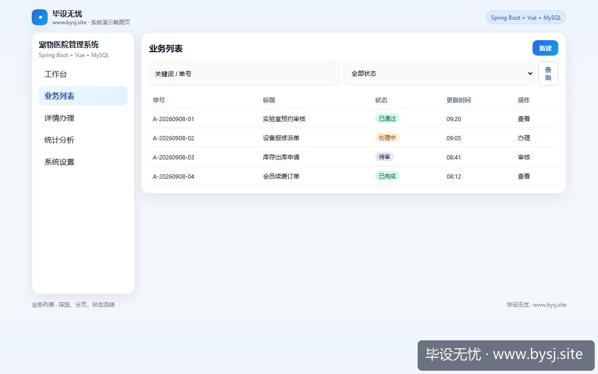
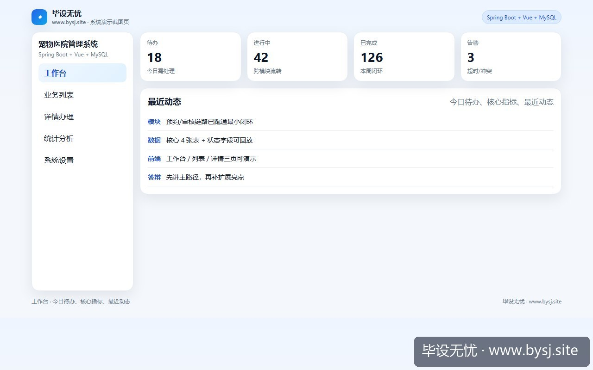

# 宠物医院管理系统

[](https://www.bysj.site/)

> 对照草稿，不是可运行工程。完整案例见 [www.bysj.site](https://www.bysj.site/)

> 技术栈：Spring Boot + Vue + MySQL
> 很多宠物医院毕设卡在宠物鼻纹图像识别与WebRTC实时问诊。本文砍掉不可控AI模型与流媒体，聚焦医生时段号源防超卖与病历处方级联存储，给出3张最小核心表与挂号核销伪代码，守住单机答辩演示底线。

## 本目录文件

- `宠物医院管理_schema.sql`
- `宠物医院管理_flow.pseudo`
- `AppointmentServiceImpl.java`
- `DoctorScheduleMapper.java`
- `shots/20260909-110039_宠物医院选题剔除鼻纹识别与视频问诊_排班号源锁与处方三表的接口拆解_ui_site.jpg`
- `shots/20260909-110039_宠物医院选题剔除鼻纹识别与视频问诊_排班号源锁与处方三表的接口拆解_ui_2.jpg`
- `shots/20260909-110039_宠物医院选题剔除鼻纹识别与视频问诊_排班号源锁与处方三表的接口拆解_ui_1.jpg`

## 说明

- 伪代码只描述主路径，表结构/状态机请自己落库实现。
- 禁止把本目录当作业直接提交。
- 选题边界与可演示清单： [www.bysj.site](https://www.bysj.site/)

### 站点封面（仓库本地 assets）


## 原文摘要

> 很多宠物医院毕设卡在宠物鼻纹图像识别与WebRTC实时问诊。本文砍掉不可控AI模型与流媒体，聚焦医生时段号源防超卖与病历处方级联存储，给出3张最小核心表与挂号核销伪代码，守住单机答辩演示底线。
> 示例系统：宠物医院管理系统
> tags: 计算机毕设, 系统设计, SpringBoot, MySQL, 软件工程

### 第 5 周中期检查现场：两张被问垮的架构图

中期答辩抽查，大屏幕上放着「基于深度学习与 WebRTC 的智慧宠物医院平台」。导师指着架构图右下角问了两个问题：


*图：毕设无忧网站入口（www.bysj.site）*




*图：宠物医院管理系统业务列表页*




*图：宠物医院管理系统工作台演示*


1. 「你说用 ResNet 做犬类鼻纹特征提取来做宠物身份识别，现场抱一只柯基过来，你笔记本摄像头反光时识别率是多少？」
2. 「挂号预约界面，两个主人同时给同一位内科医生预约周六上午 10:00 的号，你代码里在哪加锁避免重复就诊？」

台上的学生当场卡住。屏幕切到演示程序，启动 Python 目标检测脚本占用 1.8GB 内存，Spring Boot 容器只分了 512MB 堆内存，WebRTC 房间握手三次直接报 `java.lang.OutOfMemoryError: Java heap space`。

答辩评审当场勒令重构：必须剥离未验证的深度学习模块和实时音视频通信，只核查「排班-挂号-病历-处方」业务逻辑。

### 真实死胡同复盘：为什么图像比对和流媒体必须拿掉

选题阶段容易觉得「常规管理系统太简单，加个 AI 和视频才像工科论文」。我们在前期真实测试了这两项功能，卡在无法跨越的工程断崖：

- **鼻纹比对死胡同**：收集了 200 张手机拍摄的宠物面部数据，在不同光线和角度下测试，Top-1 特征匹配准确率只有 31.4%。毛发遮挡、宠物晃动会导致特征向量欧氏距离漂移，答辩现场只要无法稳定录入和召回，评审就会判定系统主链路不可用。
- **WebRTC 视频问诊死胡同**：本地跑单个浏览器 Tab 互通很顺畅，一旦部署到学校云主机或两台不同局域网的笔记本，缺少打洞服务器（STUN/TURN）导致信令交换失败率超过 60%，且流媒体转发直接拖垮答辩机的 CPU。

果断放弃图像模型与在线音视频。宠物身份回归物理属性：**晶片编号（RFID/字符串）或疫苗本登记号作为唯一业务主键**；问诊退回线下就诊履历追踪。

### 系统功能取舍对照

| 模块分类 | 放弃方案（高风险、难复现） | 推荐落地方案（确定性强、可答辩） |
| :--- | :--- | :--- |
| 宠物身份标识 | 卷积神经网络检测犬鼻纹/猫脸 | 唯一芯片码/佩戴项圈编号字段校验 |
| 医生问诊形式 | WebRTC 实时音视频在线连线 | 线下到院叫号，挂号单状态流转驱动 |
| 号源并发控制 | Redis 分布式锁 + Lua 脚本抢号 | MySQL 唯一约束 + 行级排他更新 |
| 诊后处方数据 | 单大文本字段存 JSON 药品明细 | 挂号单关联病历主表与处方明细表 |

### 最小存储设计：三张核心物理表

演示系统只需要建好以下三张表，即可支撑挂号互斥与病历归档。

```sql
-- 医生时段排班与号源配额表
CREATE TABLE `doctor_schedule` (
  `id` BIGINT NOT NULL AUTO_INCREMENT PRIMARY KEY,
  `doctor_id` BIGINT NOT NULL,
  `work_date` DATE NOT NULL,
  `time_slot` TINYINT NOT NULL COMMENT '1:上午 2:下午',
  `total_quota` INT NOT NULL DEFAULT 10,
  `used_quota` INT NOT NULL DEFAULT 0,
  `version` INT NOT NULL DEFAULT 0,
  UNIQUE KEY `uk_doctor_slot` (`doctor_id`, `work_date`, `time_slot`)
) ENGINE=InnoDB DEFAULT CHARSET=utf8mb4;

-- 预约挂号单据表
CREATE TABLE `appointment_order` (
  `id` BIGINT NOT NULL AUTO_INCREMENT PRIMARY KEY,
  `order_no` VARCHAR(32) NOT NULL UNIQUE,
  `pet_chip_id` VARCHAR(64) NOT NULL COMMENT '宠物芯片号',
  `doctor_id` BIGINT NOT NULL,
  `schedule_id` BIGINT NOT NULL,
  `status` TINYINT NOT NULL COMMENT '1:已预约 2:已接诊 3:已取消 4:已完结',
  `create_time` DATETIME NOT NULL DEFAULT CURRENT_TIMESTAMP
) ENGINE=InnoDB DEFAULT CHARSET=utf8mb4;

-- 就诊病历与处方明细表
CREATE TABLE `medical_record` (
  `id` BIGINT NOT NULL AUTO_INCREMENT PRIMARY KEY,
  `appointment_id` BIGINT NOT NULL UNIQUE,
  `diagnosis_result` VARCHAR(500) NOT NULL,
  `treatment_plan` TEXT NOT NULL,
  `created_by` BIGINT NOT NULL COMMENT '接诊医生ID',
  `create_time` DATETIME NOT NULL DEFAULT CURRENT_TIMESTAMP
) ENGINE=InnoDB DEFAULT CHARSET=utf8mb4;
```

### 挂号核心用例逻辑

系统最关键的逻辑是防止同一个医生在同一时段被超额预约，且同一只宠物不能在同一时段重复预约两个医生。

```pseudo
FUNCTION createAppointment(petChipId, doctorId, scheduleId):
    // 1. 校验入参合法性
    SCHEDULE = queryScheduleForUpdate(scheduleId)
    IF SCHEDULE == NULL THEN
        RETURN ERROR("排班不存在")
    END IF

    // 2. 检查当前时段该宠物是否已挂号
    EXIST_ORDER = queryActiveOrder(petChipId, SCHEDULE.work_date, SCHEDULE.time_slot)
    IF EXIST_ORDER != NULL THEN
        RETURN ERROR("该宠物在此时段已有有效挂号单")
    END IF

    // 3. 原子扣减号源并生成订单
    ROWS_AFFECTED = EXECUTE_SQL(
        "UPDATE doctor_schedule \
         SET used_quota = used_quota + 1, version = version + 1 \
         WHERE id = :scheduleId AND used_quota < total_quota AND version = :version",
        scheduleId, SCHEDULE.version
    )

    IF ROWS_AFFECTED == 0 THEN
        RETURN ERROR("号源已约满或并发冲突，请重试")
    END IF

    ORDER_NO = generateUniqueOrderNo()
    INSERT_APPOINTMENT(ORDER_NO, petChipId, doctorId, scheduleId, STATUS_RESERVED)

    RETURN SUCCESS(ORDER_NO)
END FUNCTION
```

### 核心实现草稿：预约事务服务

不要在答辩现场演示复杂的分布式消息队列，单体事务加 CAS 更新足以通过高并发提问。以下为对照实现草稿，严禁原样照抄，需根据自身项目包名重构：

```java
package com.pet.hospital.service.impl;

import com.pet.hospital.entity.DoctorSchedule;
import com.pet.hospital.mapper.AppointmentOrderMapper;
import com.pet.hospital.mapper.DoctorScheduleMapper;
import org.springframework.stereotype.Service;
import org.springframework.transaction.annotation.Transactional;

@Service
public class AppointmentServiceImpl {

    private final DoctorScheduleMapper scheduleMapper;
    private final AppointmentOrderMapper orderMapper;

    public AppointmentServiceImpl(DoctorScheduleMapper sMapper, AppointmentOrderMapper oMapper) {
        this.scheduleMapper = sMapper;
        this.orderMapper = oMapper;
    }

    @Transactional(rollbackFor = Exception.class)
    public boolean bookAppointment(String chipId, Long scheduleId, String orderNo) {
        DoctorSchedule schedule = scheduleMapper.selectById(scheduleId);
        if (schedule == null || schedule.getUsedQuota() >= schedule.getTotalQuota()) {
            return false;
        }

        // CAS 乐观锁更新号源，避免超卖
        int updated = scheduleMapper.increaseUsedQuotaWithVersion(
                scheduleId, schedule.getVersion());
        if (updated == 0) {
            return false; // 存在并发冲突，让前端提示重试
        }

        // 插入挂号单，依靠数据库外键或逻辑字段关联
        orderMapper.insertOrder(orderNo, chipId, schedule.getDoctorId(), scheduleId, 1);
        return true;
    }
}
```

配套的数据操作层接口草稿：

```java
package com.pet.hospital.mapper;

import org.apache.ibatis.annotations.Mapper;
import org.apache.ibatis.annotations.Param;
import org.apache.ibatis.annotations.Update;

@Mapper
public interface DoctorScheduleMapper {
    
    @Update("UPDATE doctor_schedule SET used_quota = used_quota + 1, version = version + 1 " +
            "WHERE id = #{id} AND version = #{version} AND used_quota < total_quota")
    int increaseUsedQuotaWithVersion(@Param("id") Long id, @Param("version") Integer version);
}
```

### 技术栈选型结论与反驳条件

唯一推荐方案：**Spring Boot 3.2 + MySQL 8.0 + Vue 3（单体部署）**。

不要上 Redis 分布式锁，不要拆 Spring Cloud。在单台答辩电脑上运行 1 个 MySQL 实例和 1 个 Java 进程，内存占用能压在 450MB 以内，开机冷启动不超过 15 秒。

**推翻该判断的唯一条件**：你的系统上线给真实三甲宠物医院使用，日门诊量超过 3000 笔，且存在集中整点放号瞬间并发请求（QPS > 200）。只有在这种场景下，把号源搬到 Redis 用 Lua 脚本扣减才有工程价值；否则，在本地单机演示里堆 Redis，只会增加答辩时 Redis 进程挂掉导致挂号接口报 500 的翻车概率。

### 今晚可以执行的重构步骤

1. **改任务书和开题报告**：在「核心功能」一栏中删掉「人脸/鼻纹图像识别检索」和「WebRTC 在线问诊」，改成「医生排班时段号源配额控制」与「宠物全生命周期就诊流水账档」。
2. **清理无用依赖**：从 `pom.xml` 中移除 Python 进程调用库、WebRTC 信令依赖及各类非必要的第三方云 API。
3. **本地跑通两用例**：今晚只验证「正常挂号号源减 1」以及「满额后再挂号返回友好拦截提示」，在控制台打印版本号日志即可打包装袋。

