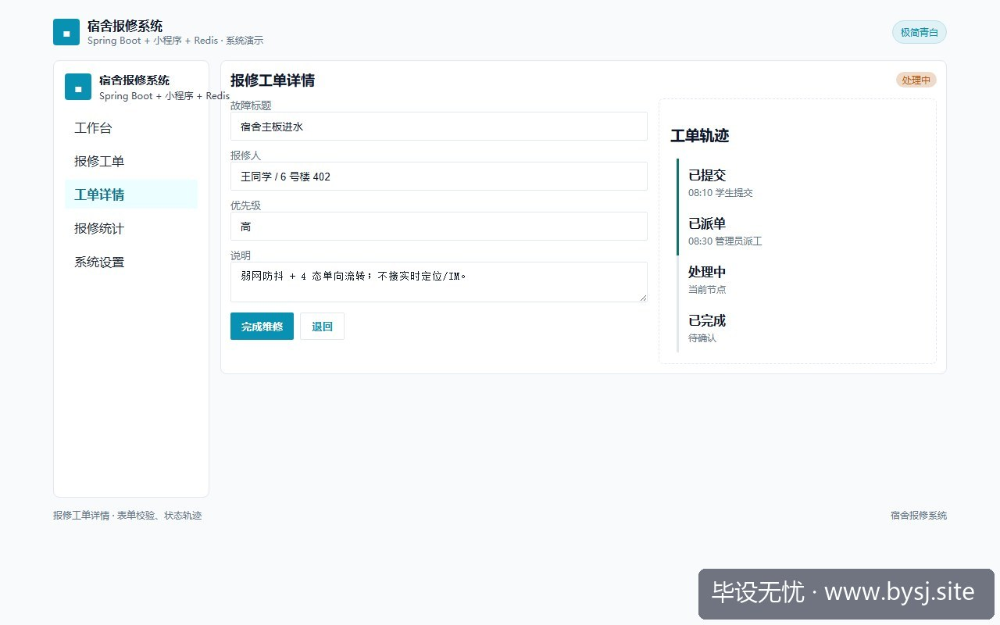
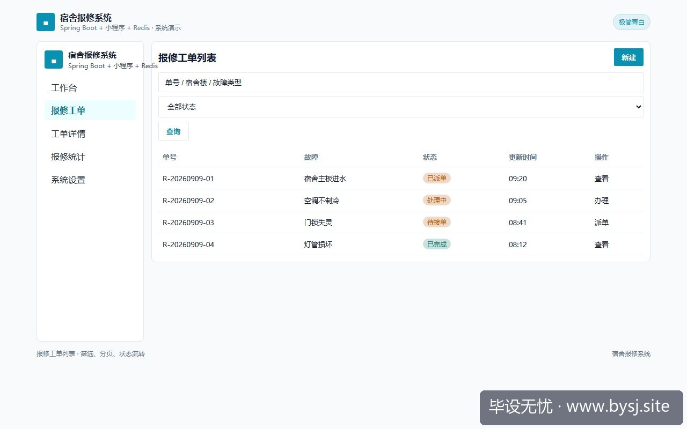
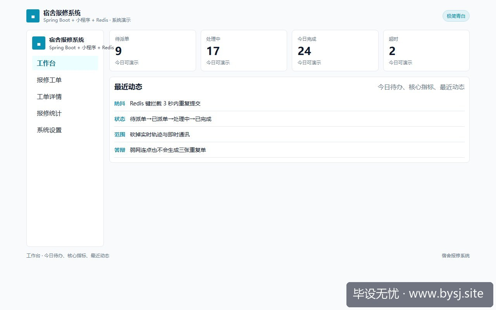

# 宿舍报修系统

[](https://www.bysj.site/)

> 对照草稿，不是可运行工程。完整案例见 [www.bysj.site](https://www.bysj.site/)

> 技术栈：Spring Boot + 小程序 + Redis
> 多数报修系统毕设在中期崩在抢单并发锁与耗材负库存上。本文剔除抢单大厅与进销存链路，收敛为楼栋网格指派与工单单向闭环，给出3张核心表、Redis防抖派工Service草稿与5个接口预算，守住单机稳定演示底线。

## 本目录文件

- `宿舍报修_schema.sql`
- `RepairOrderServiceImpl.java`
- `RepairOrderMapper.java`
- `宿舍报修_flow.pseudo`
- `shots/20260911-102045_宿舍报修别碰抢单池与耗材进销存_5个核心接口与Redis幂等键的开题边界_ui_3.jpg`
- `shots/20260911-102045_宿舍报修别碰抢单池与耗材进销存_5个核心接口与Redis幂等键的开题边界_ui_2.jpg`
- `shots/20260911-102045_宿舍报修别碰抢单池与耗材进销存_5个核心接口与Redis幂等键的开题边界_ui_1.jpg`
- `shots/20260911-102045_宿舍报修别碰抢单池与耗材进销存_5个核心接口与Redis幂等键的开题边界_ui_site.jpg`

## 说明

- 伪代码只描述主路径，表结构/状态机请自己落库实现。
- 禁止把本目录当作业直接提交。
- 选题边界与可演示清单： [www.bysj.site](https://www.bysj.site/)

### 站点封面（仓库本地 assets）


## 原文摘要

> 多数报修系统毕设在中期崩在抢单并发锁与耗材负库存上。本文剔除抢单大厅与进销存链路，收敛为楼栋网格指派与工单单向闭环，给出3张核心表、Redis防抖派工Service草稿与5个接口预算，守住单机稳定演示底线。
> 示例系统：宿舍报修系统
> tags: SpringBoot, 宿舍报修系统, 毕业设计, Redis, 系统设计

### 1. 中期检查现场：抢单死锁与不存在的备件库

第 5 周中期检查现场，一台笔记本连着热点，左边窗口登录「水暖工张师傅」，右边窗口登录「电工李师傅」。学生想演示高级特性「抢单并发控制」，同时点击抢修 3 号楼 402 的水管漏水工单。后端控制台瞬间刷出两屏异常：



*图：宿舍报修系统报修工单详情*




*图：宿舍报修系统报修工单列表*




*图：宿舍报修系统工作台演示*


```text
org.springframework.orm.ObjectOptimisticLockingFailureException: 
Object of class [com.example.repair.entity.RepairOrder] with identifier [10492]: 
optimistic locking failed; nested exception is org.hibernate.StaleObjectStateException
```

页面停在加载菊花上，工单既没被抢走，也没回到待办池。学生慌忙切到数据库手动 update 状态，结果下一项「耗材出库联动」又被抓现行：维修工单直接扣减了日光灯管库存，库存字段被减成了 `-1`。

答辩评委直接打断并提了两个问题：
1. 高校后勤维修全靠园区网格划片（1至4号楼归张师傅组，5至8号楼归李师傅组），什么时候允许跨工种、跨楼栋在手机上拼手速抢单？
2. 扣减的灯管进价多少？领料谁审批？如果没做完整的采购与盘点台账，在报修表里放一个 `stock = stock - 1` 字段究竟想表达什么？

一句话切中要害：很多选题在立项时为了显得工作量大，硬把「物业工单」做成了「外卖抢单平台」加「简易 ERP」。学生连真实的楼宇指派规则都没摸清，就先陷入了并发事务和伪库存校验的泥潭。

---

### 2. 真实死胡同：两周耗在抢单锁与进销存的后果

在毕设推进中，最容易让进度陷入停滞的正是抢单与备件这两个虚构需求：

1. **抢单并发死胡同**：学生尝试在单机环境用 `SELECT ... FOR UPDATE` 或 JPA 的 `@Version` 乐观锁。结果本地并发测试时，要么双击触发死锁，要么一人抢到后另一人前端吞掉报错、页面静止。为了解决这个本身不该存在的问题，学生又去套 Redis 分布式锁，两周时间全在调 Lua 脚本和 Redisson 依赖，真正的学生报修流程和催办流转反而一行没动。
2. **耗材联动死胡同**：只要写了备件扣减，答辩老师必然顺藤摸瓜追问耗材从哪来。如果回答「在后台手动加个数字」，就破坏了数据库的业务因果链；如果真去补齐供应商、采购入库、领料退库，系统直接膨胀出 6 张表，代码量激增 800 行。

#### 原型规划与可行演示范围对照

| 模块划分 | 计划堆砌的特性（极易翻车） | 实际收敛后的演示范围（稳定交付） | 答辩时老师关心的指标 |
| :--- | :--- | :--- | :--- |
| **报修提交** | 语音转文字、AI 图像识别水管破损、地图高精度定位 | 楼栋下拉联动、文字描述、单图上传、单号自动生成 | 提交防抖、必填校验、脏数据拦截 |
| **工单流转** | 抢单大厅、WebSocket 实时呼叫、派单超时惩罚 | 管理员/宿管人工指派、维修工接单、处理中、已完成 | 状态单向不可逆、操作时间留痕 |
| **耗材管理** | 备品进销存、单价折算、财务报销接口 | 剔除此模块，在工单备注中手填「更换水龙头*1」 | 不做伪 ERP，聚焦报修主干业务 |
| **交付评价** | 复杂多维度雷达图打分、打赏师傅、在线申诉 | 1至5星评分、一条文本评语、结单归档 | 评价与工单 1:1 约束、不可重复评 |

---

### 3. 边界收缩：单机演示的唯一栈与切换条件

做宿舍报修系统，默认推荐技术栈：
* **后端**：Spring Boot 3.2.x + MyBatis-Plus
* **数据库**：MySQL 8.0（InnoDB 引擎，依靠事务与唯一索引收尾）
* **缓存组件**：Redis 6.2+（仅承担提交防抖与防重复派工）
* **前端**：微信小程序原生框架（学生端/师傅端） + Vue 3 纯管理端（宿管/后勤处）

**放弃抢单后的切换条件**：
只有当你的课题题目明确包含「基于协同过滤的维修负荷调度」或「高并发抢单机制研究」，且能提供全校 300 名维修工、每日 2000 单以上的真实打卡数据时，才有理由引入动态派单算法或抢单队列。否则，一律退回「网格化人工派工」。

系统只需要 5 个核心接口预算：
1. `POST /api/order/submit`（学生提交报修，Redis 设 5 秒幂等键）
2. `POST /api/order/dispatch`（管理员指派师傅，行级排他校验）
3. `POST /api/order/accept`（师傅接单签到）
4. `POST /api/order/complete`（师傅提交维修凭证并结单）
5. `POST /api/order/evaluate`（学生评价并归档）

---

### 4. 最小核心表结构设计

放弃耗材表与抢单中间表后，核心业务只需 3 张物理表。表结构必须体现状态约束与时间线留痕。

```sql
-- 1. 工单主表：严格控制状态枚举值
CREATE TABLE `repair_order` (
  `id` BIGINT NOT NULL AUTO_INCREMENT COMMENT '主键',
  `order_no` VARCHAR(32) NOT NULL COMMENT '业务单号(年月日+递增流水)',
  `student_id` BIGINT NOT NULL COMMENT '报修学生ID',
  `building_no` VARCHAR(16) NOT NULL COMMENT '楼栋如: 3号楼',
  `room_no` VARCHAR(16) NOT NULL COMMENT '宿舍号如: 402',
  `category` VARCHAR(32) NOT NULL COMMENT '类别: 水暖/电路/泥瓦/门窗',
  `description` VARCHAR(500) NOT NULL COMMENT '故障详情',
  `image_url` VARCHAR(255) DEFAULT NULL COMMENT '现场照片',
  `worker_id` BIGINT DEFAULT NULL COMMENT '被指派维修工ID',
  `status` TINYINT NOT NULL DEFAULT 10 COMMENT '10待派工, 20待维修, 30维修中, 40已完成, 50已评价',
  `create_time` DATETIME NOT NULL DEFAULT CURRENT_TIMESTAMP,
  `update_time` DATETIME NOT NULL DEFAULT CURRENT_TIMESTAMP ON UPDATE CURRENT_TIMESTAMP,
  PRIMARY KEY (`id`),
  UNIQUE KEY `uk_order_no` (`order_no`),
  KEY `idx_student_status` (`student_id`, `status`),
  KEY `idx_worker_status` (`worker_id`, `status`)
) ENGINE=InnoDB DEFAULT CHARSET=utf8mb4 COMMENT='报修工单表';

-- 2. 节点日志表：答辩时展示流程轨迹的关键，替代复杂IM系统
CREATE TABLE `repair_log` (
  `id` BIGINT NOT NULL AUTO_INCREMENT,
  `order_id` BIGINT NOT NULL COMMENT '关联主表ID',
  `operator_id` BIGINT NOT NULL COMMENT '操作人ID',
  `operator_role` VARCHAR(16) NOT NULL COMMENT '角色: STUDENT/ADMIN/WORKER',
  `action` VARCHAR(32) NOT NULL COMMENT '动作: 提交/指派/接单/修复/评价',
  `remark` VARCHAR(255) DEFAULT NULL COMMENT '操作备注',
  `create_time` DATETIME NOT NULL DEFAULT CURRENT_TIMESTAMP,
  PRIMARY KEY (`id`),
  KEY `idx_order_id` (`order_id`)
) ENGINE=InnoDB DEFAULT CHARSET=utf8mb4 COMMENT='工单流转日志表';

-- 3. 维修工与网格分区表
CREATE TABLE `repair_worker` (
  `id` BIGINT NOT NULL AUTO_INCREMENT,
  `name` VARCHAR(32) NOT NULL COMMENT '师傅姓名',
  `phone` VARCHAR(11) NOT NULL COMMENT '联系电话',
  `category` VARCHAR(32) NOT NULL COMMENT '负责工种',
  `assigned_zone` VARCHAR(64) NOT NULL COMMENT '负责片区如: 1-4号楼',
  `status` TINYINT NOT NULL DEFAULT 1 COMMENT '1正常接单, 0休假',
  PRIMARY KEY (`id`)
) ENGINE=InnoDB DEFAULT CHARSET=utf8mb4 COMMENT='维修人员网格表';
```

---

### 5. 核心用例伪代码与防重派工草稿

下面的伪代码展示网格人工派工时，如何确保一个工单不会被重复分发，且必须符合状态单向跃迁。

```pseudo
FUNCTION dispatchOrder(orderId, workerId, adminId):
    // 1. 获取防重锁，避免管理员连续点击造成多重分发
    lockKey = "lock:dispatch:" + orderId
    IF NOT redis.setNx(lockKey, "locked", EXPIRE_SECONDS = 3) THEN:
        THROW BusinessException("当前工单正在派发中，请勿重复操作")
    END IF

    TRY:
        // 2. 校验工单当前必须是待派单状态 (10)
        order = queryOrderById(orderId)
        IF order == NULL OR order.status != 10 THEN:
            THROW BusinessException("工单状态已变更，不可指派")
        END IF

        // 3. 校验维修工状态及网格匹配
        worker = queryWorkerById(workerId)
        IF worker.status != 1 THEN:
            THROW BusinessException("维修师傅处于休假状态")
        END IF

        // 4. 原子更新工单状态与指派人，写入流转历史
        BEGIN TRANSACTION
            UPDATE repair_order 
            SET worker_id = workerId, status = 20 
            WHERE id = orderId AND status = 10
            
            INSERT INTO repair_log(order_id, operator_id, operator_role, action, remark)
            VALUES (orderId, adminId, 'ADMIN', '指派师傅', '指派给:' + worker.name)
        COMMIT TRANSACTION
    FINALLY:
        redis.delete(lockKey)
    END TRY
END FUNCTION
```

下面是后端的具体实现对照草稿。该代码展示了状态机更新与日志联动的落地方式，非完整工程，需自行接入你的公共异常与响应包装层。

```java
// RepairOrderServiceImpl.java (示意草稿，需自行实现依赖注入)
package com.example.repair.service.impl;

import com.example.repair.entity.RepairOrder;
import com.example.repair.entity.RepairLog;
import com.example.repair.mapper.RepairOrderMapper;
import com.example.repair.mapper.RepairLogMapper;
import org.springframework.stereotype.Service;
import org.springframework.transaction.annotation.Transactional;
import org.springframework.data.redis.core.StringRedisTemplate;
import java.util.concurrent.TimeUnit;

@Service
public class RepairOrderServiceImpl {
    private final RepairOrderMapper orderMapper;
    private final RepairLogMapper logMapper;
    private final StringRedisTemplate redisTemplate;

    public RepairOrderServiceImpl(RepairOrderMapper om, RepairLogMapper lm, StringRedisTemplate rt) {
        this.orderMapper = om;
        this.logMapper = lm;
        this.redisTemplate = rt;
    }

    @Transactional(rollbackFor = Exception.class)
    public boolean dispatch(Long orderId, Long workerId, Long adminId) {
        String lockKey = "lock:dispatch:" + orderId;
        Boolean acquired = redisTemplate.opsForValue().setIfAbsent(lockKey, "1", 3, TimeUnit.SECONDS);
        if (Boolean.FALSE.equals(acquired)) {
            throw new IllegalStateException("派工请求正在处理，请稍后刷新");
        }
        try {
            // 基于数据库当前状态条件更新，返回影响行数，抗并发重派
            int rows = orderMapper.updateStatusToDispatched(orderId, workerId, 10, 20);
            if (rows == 0) {
                throw new IllegalStateException("派工失败：工单不存在或已不再是待派工状态");
            }
            RepairLog log = new RepairLog(orderId, adminId, "ADMIN", "指派工单", "工单已转交维修工ID:" + workerId);
            logMapper.insert(log);
            return true;
        } finally {
            redisTemplate.delete(lockKey);
        }
    }
}
```

配套的 MyBatis 映射代码严格依赖条件更新，将并发冲突防御下沉在单条 SQL 之中：

```java
// RepairOrderMapper.java (示意草稿)
package com.example.repair.mapper;

import org.apache.ibatis.annotations.Mapper;
import org.apache.ibatis.annotations.Param;
import org.apache.ibatis.annotations.Update;

@Mapper
public interface RepairOrderMapper {
    @Update("UPDATE repair_order SET worker_id = #{workerId}, status = #{targetStatus} " +
            "WHERE id = #{orderId} AND status = #{expectStatus}")
    int updateStatusToDispatched(@Param("orderId") Long orderId,
                                 @Param("workerId") Long workerId,
                                 @Param("expectStatus") Integer expectStatus,
                                 @Param("targetStatus") Integer targetStatus);
}
```

---

### 6. 实操落地步骤与答辩演示准备

在接下来的实现中，按照四步顺序推进，不要跳过顺序：

1. **跑通逆向生成与枚举固化**：在本地 MySQL 8.0 中创建 `repair_order`、`repair_log`、`repair_worker` 三张表。在 Java 代码中声明常量或枚举（10-待派工，20-待维修，30-处理中，40-已完成，50-已评价），禁止直接在 Controller 传裸数字。
2. **实现两个核心表单提交**：优先写完学生微信小程序的「报修申请页」和后勤 Web 端的「指派工单下拉框」。在报修提交端加入基于 `studentId + category + 10秒` 的 Redis 防抖处理，避免学生因网络延迟连续提交 3 个一模一样的水龙头报修单。
3. **连通时间线日志输出**：每一次工单状态更迭，必须强制向 `repair_log` 插入一条记录。小程序详情页下方直接调用该表的历史列表，渲染成「报修申请 -> 宿管派工 -> 师傅接单 -> 维修完工 -> 评价打分」的线性竖向步骤条。在答辩现场，这一条步骤条比任何口头汇报都更有说服力。
4. **准备现场演示的边界应对**：
   * 当被问及“为什么不做师傅抢单？”回答：“调研后勤运营规范，维修执行楼栋网格责任制，随意抢单会导致冷门故障滞留，因此系统采用宿管按网格指派模式。”
   * 当被问及“为什么没有零配件库存管理？”回答：“毕设核心目标聚焦报修闭环流程与时效留痕，耗材进销存属于物料仓储系统范畴，跨模块耦合会降低当前工单流转的审计可靠性。”

高校报修系统真正的工程质量在于每一步流转都有据可查，而不是在脆弱的单机开发环境里硬拼不存在的高并发抢单场景。


*图：毕设无忧网站入口（www.bysj.site）*

