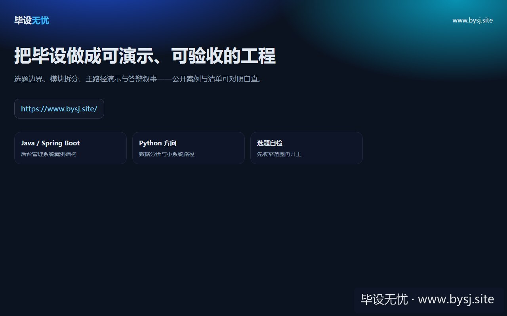
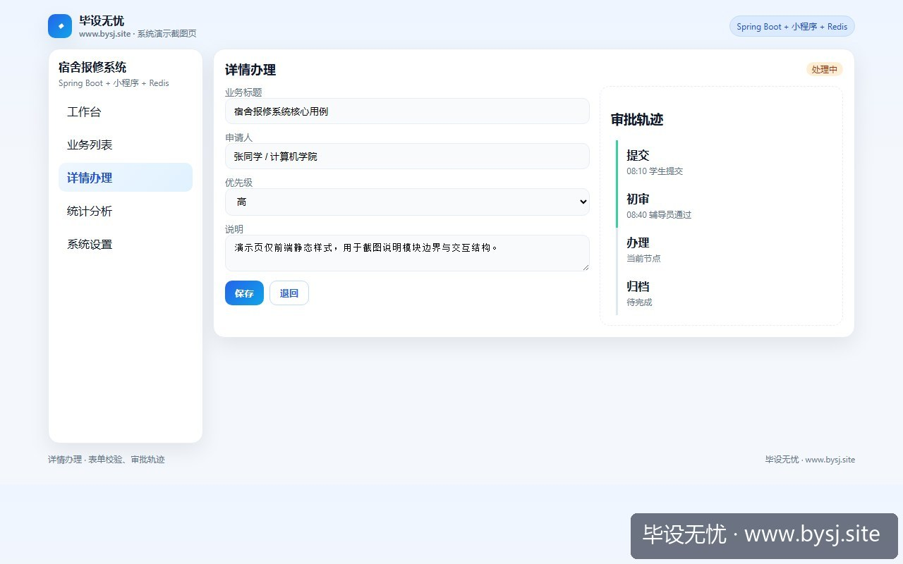
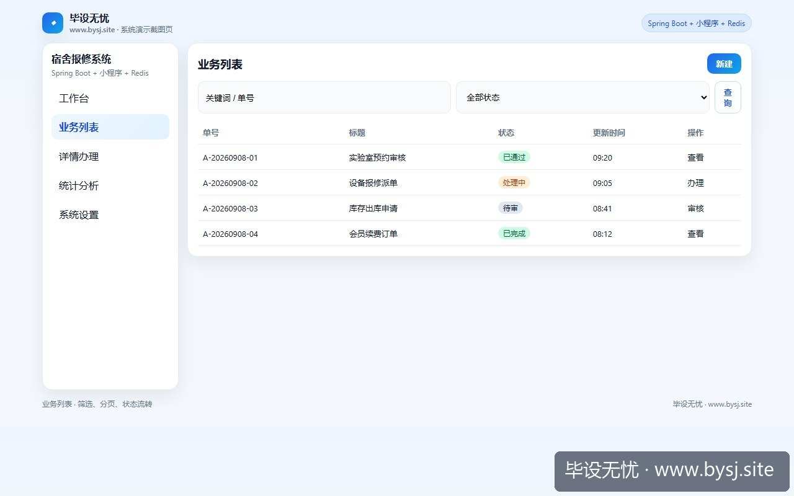
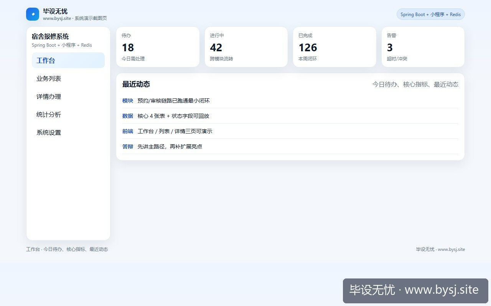
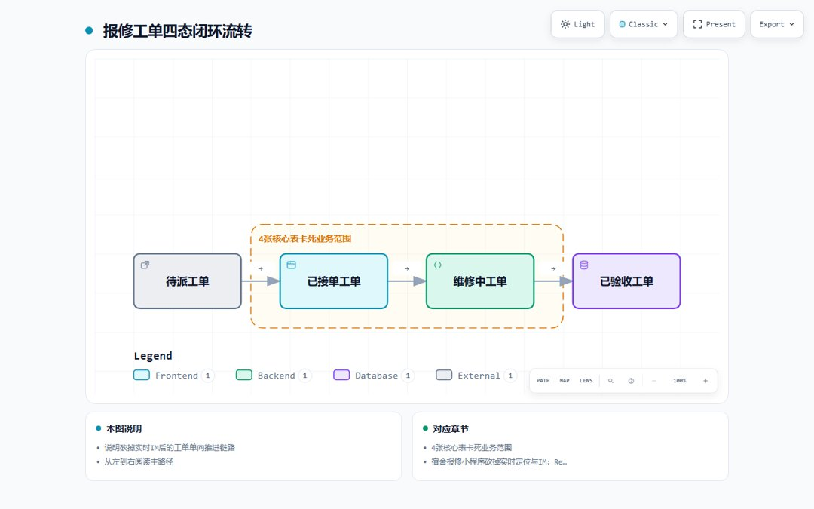
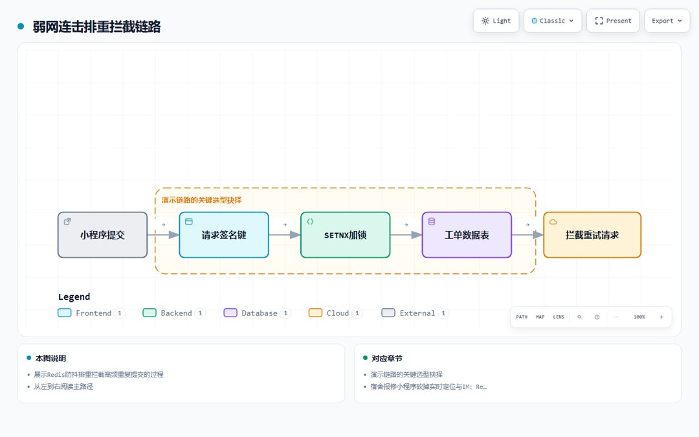
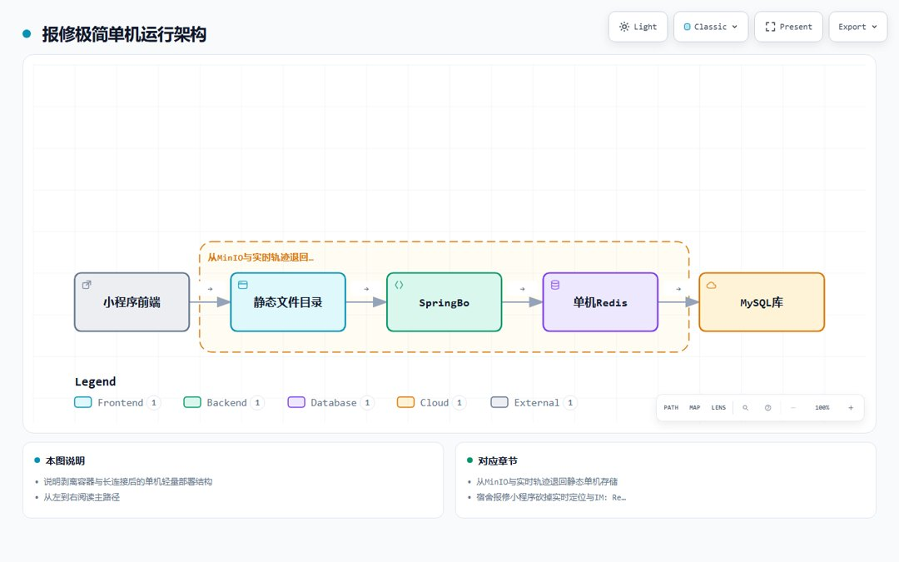

# 宿舍报修系统

[](https://www.bysj.site/)

> 对照草稿，不是可运行工程。完整案例见 [www.bysj.site](https://www.bysj.site/)

> 技术栈：Spring Boot + 小程序 + Redis
> 宿舍报修毕设常因硬塞师傅实时轨迹与WebSocket聊天，导致本地内存耗尽或表单连击插库。本文以单机Redis防抖排重与工单4态单向流转为边界，给出4张核心表、状态校验与防重提交实现，保障演示环境稳定不翻车。

## 本目录文件

- `宿舍报修_schema.sql`
- `RepairOrderController.java`
- `RepairOrderServiceImpl.java`
- `shots/20260909-102051_宿舍报修小程序砍掉实时定位与IM_Redis防抖排重与4态单向流转实现_ui_site.jpg`
- `shots/20260909-102051_宿舍报修小程序砍掉实时定位与IM_Redis防抖排重与4态单向流转实现_ui_3.jpg`
- `shots/20260909-102051_宿舍报修小程序砍掉实时定位与IM_Redis防抖排重与4态单向流转实现_ui_2.jpg`
- `shots/20260909-102051_宿舍报修小程序砍掉实时定位与IM_Redis防抖排重与4态单向流转实现_ui_1.jpg`
- `shots/20260909-102051_宿舍报修小程序砍掉实时定位与IM_Redis防抖排重与4态单向流转实现_3.jpg`
- `shots/20260909-102051_宿舍报修小程序砍掉实时定位与IM_Redis防抖排重与4态单向流转实现_2.jpg`
- `shots/20260909-102051_宿舍报修小程序砍掉实时定位与IM_Redis防抖排重与4态单向流转实现_1.jpg`

## 说明

- 伪代码只描述主路径，表结构/状态机请自己落库实现。
- 禁止把本目录当作业直接提交。
- 选题边界与可演示清单： [www.bysj.site](https://www.bysj.site/)

### 站点封面（仓库本地 assets）


## 原文摘要

> 宿舍报修毕设常因硬塞师傅实时轨迹与WebSocket聊天，导致本地内存耗尽或表单连击插库。本文以单机Redis防抖排重与工单4态单向流转为边界，给出4张核心表、状态校验与防重提交实现，保障演示环境稳定不翻车。
> 示例系统：宿舍报修系统
> tags: SpringBoot, 微信小程序, 毕业设计, Redis, 系统设计

第6周小程序联调现场，测试机在宿舍楼道弱网环境下点下“确认报修”，前端没有即时反馈，手指连续点了三次。后台控制台瞬间刷出三条一模一样的主板进水报修记录，单号递增，分配了三个不同的维修工人ID。紧接着，本地后端报出内存警告——为了做“师傅实时接单定位”，工程里挂了高德地图逆地理编码与全局WebSocket广播，微信开发者工具和管理后台反复刷新几次，Tomcat的工作线程池直接被占满。



*图：毕设无忧网站入口（www.bysj.site）*




*图：宿舍报修系统详情办理页*




*图：宿舍报修系统业务列表页*




*图：宿舍报修系统工作台演示*




*图：落地路径示意 · 报修工单四态闭环流转（说明砍掉实时IM后的工单单向推进链路）*




*图：请求调用链 · 弱网连击排重拦截链路（展示Redis防抖排重拦截高频重复提交的过程）*




*图：系统架构示意 · 报修极简单机运行架构（说明剥离容器与长连接后的单机轻量部署结构）*


很多同学做宿舍报修，第一反应是把美团或滴滴的履约链搬进来：师傅接单实时在地图上跑、学生和师傅在小程序里即时发语音传视频、系统后台搞算法最优派工。结果中期检查时，光是真机地图Token白名单和WebSocket心跳断连重试，就卡掉了两周时间，连一张工单从提交到维修完成的正常闭环都走不通。

### 从MinIO与实时轨迹退回静态单机存储

项目最初搭建时，容易陷入过度工程化的死胡同。当时为了让架构图看起来“工业级”，做过这样一套链路：

1. 搭建本地MinIO容器用于处理报修现场拍照上传；
2. 引入高德地图Web端JSAPI，师傅小程序端每隔10秒上报一次经纬度；
3. 后端维护一个ConcurrentHashMap管理WebSocket Session，只要状态变动就全员推消息。

这套方案在本地跑了三天就被彻底废弃。首先，宿主机只有16G内存，同时启动IDEA、MySQL、Redis、微信开发者工具和MinIO容器后，Spring Boot冷启动耗时从8秒飙升到48秒，还经常偶发OOM。其次，宿舍场景下的维修基本都在同一园区，高德定位在楼栋内部的垂直高度（楼层）根本无法识别，地图上的经纬度全漂在宿舍楼下的人工湖里，演示时极为尴尬。

果断停掉全部长连接与容器化对象存储，把链路切回到最平直的单机形态：图片直接走Spring Boot本地静态资源目录映射，前端工单刷新全部改成被动拉取，地图轨迹全部砍掉，只保留“楼栋号-单元-房间号”的三级固定级联。

### 演示链路的关键选型抉择

报修系统的核心任务是信息建单、状态交接和结果验收，把外围的花哨功能剥离后，技术选型的唯一原则是能在单台笔记本上无报错连续跑通20次流转。

| 模块维度 | 复杂堆砌方案（易翻车） | 推荐落地方案（默认） | 方案切换条件 |
| :--- | :--- | :--- | :--- |
| 凭证图片存储 | 私有部署MinIO或FastDFS集群 | 本地WebMvcConfigurer资源映射 | 图片并发上传>50MB/s或需公网CDN加速 |
| 状态协同方式 | WebSocket双工广播推送 | 小程序onShow钩子被动拉取接口 | 明确要求多端实时协同看板且网络环境极佳 |
| 重复提交防御 | 纯前端按钮disabled属性控制 | Redis分布式锁/SETNX排重键（5秒） | 单机无并发压测要求时可收敛为DB唯一索引 |
| 师傅接单模式 | 经纬度网格动态排队分发 | 管理员后台手动指派或按楼宇静态认领 | 接入了真实的工勤排班系统与考勤数据源 |

对于毕设而言，默认推荐**Spring Boot 2.7.x + 微信小程序原生框架 + 单机Redis 6.x**。只有当导师在任务书中强制写明“必须接入第三方云存储平台”时，才将本地资源映射切换为阿里云OSS Starter，否则多加一个外部依赖就多一层断网翻车的概率。

### 4张核心表卡死业务范围

把业务收敛后，数据库只需要4张实体表即可撑起全部答辩演示，不要再去建立复杂的备件库存联动和工时计费账单。

```sql
-- 1. 宿舍房源物理映射表
CREATE TABLE `dorm_room` (
  `id` bigint(20) NOT NULL AUTO_INCREMENT,
  `building_no` varchar(16) NOT NULL COMMENT '楼栋号 如：12栋',
  `unit_no` varchar(16) DEFAULT NULL COMMENT '单元号',
  `room_no` varchar(16) NOT NULL COMMENT '房间号 如：402',
  `bed_count` int(2) DEFAULT 4 COMMENT '床位数',
  PRIMARY KEY (`id`),
  UNIQUE KEY `uk_room` (`building_no`, `room_no`)
) ENGINE=InnoDB DEFAULT CHARSET=utf8mb4;

-- 2. 报修分类表
CREATE TABLE `repair_category` (
  `id` bigint(20) NOT NULL AUTO_INCREMENT,
  `category_name` varchar(32) NOT NULL COMMENT '类别：水暖/电路/门窗/家具',
  `priority_level` tinyint(1) DEFAULT 2 COMMENT '优先级：1紧急 2常规',
  PRIMARY KEY (`id`)
) ENGINE=InnoDB DEFAULT CHARSET=utf8mb4;

-- 3. 核心报修工单表
CREATE TABLE `repair_order` (
  `id` bigint(20) NOT NULL AUTO_INCREMENT,
  `order_no` varchar(32) NOT NULL COMMENT '业务流水号',
  `student_id` bigint(20) NOT NULL COMMENT '报修人ID',
  `dorm_id` bigint(20) NOT NULL COMMENT '宿舍关联ID',
  `category_id` bigint(20) NOT NULL COMMENT '分类ID',
  `description` varchar(500) NOT NULL COMMENT '故障描述',
  `image_urls` varchar(1024) DEFAULT NULL COMMENT '以英文逗号分隔的本地图片相对路径',
  `status` tinyint(2) NOT NULL DEFAULT 10 COMMENT '状态: 10待派工 20维修中 30待验收 40已结单',
  `worker_id` bigint(20) DEFAULT NULL COMMENT '指派维修工ID',
  `create_time` datetime NOT NULL DEFAULT CURRENT_TIMESTAMP,
  `update_time` datetime NOT NULL DEFAULT CURRENT_TIMESTAMP ON UPDATE CURRENT_TIMESTAMP,
  PRIMARY KEY (`id`),
  UNIQUE KEY `uk_order_no` (`order_no`),
  KEY `idx_student` (`student_id`),
  KEY `idx_status` (`status`)
) ENGINE=InnoDB DEFAULT CHARSET=utf8mb4;

-- 4. 工单流转操作日志表（状态机跳跃痕迹）
CREATE TABLE `repair_order_log` (
  `id` bigint(20) NOT NULL AUTO_INCREMENT,
  `order_id` bigint(20) NOT NULL COMMENT '工单主键',
  `pre_status` tinyint(2) NOT NULL COMMENT '变更前状态',
  `post_status` tinyint(2) NOT NULL COMMENT '变更后状态',
  `operator_id` bigint(20) NOT NULL COMMENT '操作人ID',
  `remark` varchar(255) DEFAULT NULL COMMENT '流转批注或验收评价',
  `create_time` datetime NOT NULL DEFAULT CURRENT_TIMESTAMP,
  PRIMARY KEY (`id`)
) ENGINE=InnoDB DEFAULT CHARSET=utf8mb4;
```

### 接口实现：防抖拦截与单向状态流转

报修系统在演示过程中最忌讳两个报错：一是学生端连点生成重复单，二是工单状态跨越（比如刚派工就被学生在前端点了已完成验收）。

针对连点问题，在小程序报修提交接口层，使用Redis的原子性设值做一层5秒窗口的幂等排重。以下代码为Spring Boot环境下的轻量实现（可直接运行）：

```java
@RestController
@RequestMapping("/api/repair")
public class RepairOrderController {

    @Autowired
    private StringRedisTemplate redisTemplate;
    
    @Autowired
    private RepairOrderService repairOrderService;

    @PostMapping("/submit")
    public ResponseEntity<String> submitOrder(@RequestBody @Validated RepairSubmitDTO dto, 
                                              @RequestAttribute("userId") Long userId) {
        // 构造用户针对同一宿舍、同一分类的防抖 Key
        String lockKey = String.format("repair:submit:lock:%d:%d:%d", 
                                       userId, dto.getDormId(), dto.getCategoryId());
        
        // 5秒内禁止重复发起相同报修（返回布尔值）
        Boolean acquired = redisTemplate.opsForValue()
                .setIfAbsent(lockKey, "1", Duration.ofSeconds(5));
        
        if (Boolean.FALSE.equals(acquired)) {
            return ResponseEntity.status(HttpStatus.TOO_MANY_REQUESTS)
                    .body("正在提交中，请勿频繁点击");
        }

        try {
            String orderNo = repairOrderService.createOrder(dto, userId);
            return ResponseEntity.ok(orderNo);
        } catch (Exception e) {
            // 出现业务异常及时清除锁，允许用户重试
            redisTemplate.delete(lockKey);
            return ResponseEntity.status(HttpStatus.INTERNAL_SERVER_ERROR).body("提交失败，请重试");
        }
    }
}
```

工单流转逻辑必须卡死单向状态机，杜绝在Controller层随意使用简单的`updateById`更新状态。只有符合业务合法走向的转移才被允许：

1. 待派工 (10) -> 维修中 (20)：管理员操作，必须附带非空的 `worker_id`；
2. 维修中 (20) -> 待验收 (30)：师傅端操作，记录维修完成批注；
3. 待验收 (30) -> 已结单 (40)：学生端操作，校验当前登录用户必须为该工单的 `student_id`；
4. 异常废弃 (10/20) -> 已取消 (99)：必须填入取消理由，记录到日志表。

```java
@Service
public class RepairOrderServiceImpl implements RepairOrderService {

    @Autowired
    private RepairOrderMapper orderMapper;
    @Autowired
    private RepairOrderLogMapper logMapper;

    @Transactional(rollbackFor = Exception.class)
    @Override
    public void transitionStatus(Long orderId, Integer targetStatus, Long operatorId, String remark) {
        RepairOrder order = orderMapper.selectById(orderId);
        if (order == null) {
            throw new IllegalArgumentException("工单不存在");
        }

        Integer current = order.getStatus();
        // 严格状态跃迁校验，禁止逆向流转与越级流转
        boolean valid = (current == 10 && targetStatus == 20)
                     || (current == 20 && targetStatus == 30)
                     || (current == 30 && targetStatus == 40)
                     || ((current == 10 || current == 20) && targetStatus == 99);

        if (!valid) {
            throw new IllegalStateException(String.format("非法操作：工单无法从[%d]流转至[%d]", current, targetStatus));
        }

        // 更新主表状态
        order.setStatus(targetStatus);
        orderMapper.updateById(order);

        // 写流转审计日志
        RepairOrderLog log = new RepairOrderLog();
        log.setOrderId(orderId);
        log.setPreStatus(current);
        log.setPostStatus(targetStatus);
        log.setOperatorId(operatorId);
        log.setRemark(remark);
        logMapper.insert(log);
    }
}
```

### 落地排查与演练顺序

在做这套系统时，答辩老师问得最多的并非“你如何调度师傅”，而是“多个人同时报修水管爆了怎么办”和“工单状态被恶意修改了如何定位”。

今晚可以落实两件事：

1. 检查自己的 `repair_order` 表，删掉所有跟实时坐标、即时聊天相关的多余字段，只留一张 `repair_order_log` 专门记录状态跃迁历史。
2. 在小程序端把多图上传压缩为最多3张，并在后端的资源配置类中配置好单机静态目录映射，避免答辩时因为网络限制连不上任何公网图床。" content_markdown"

