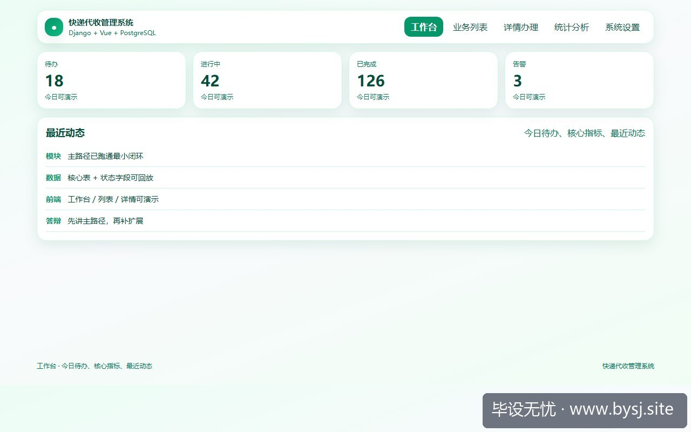
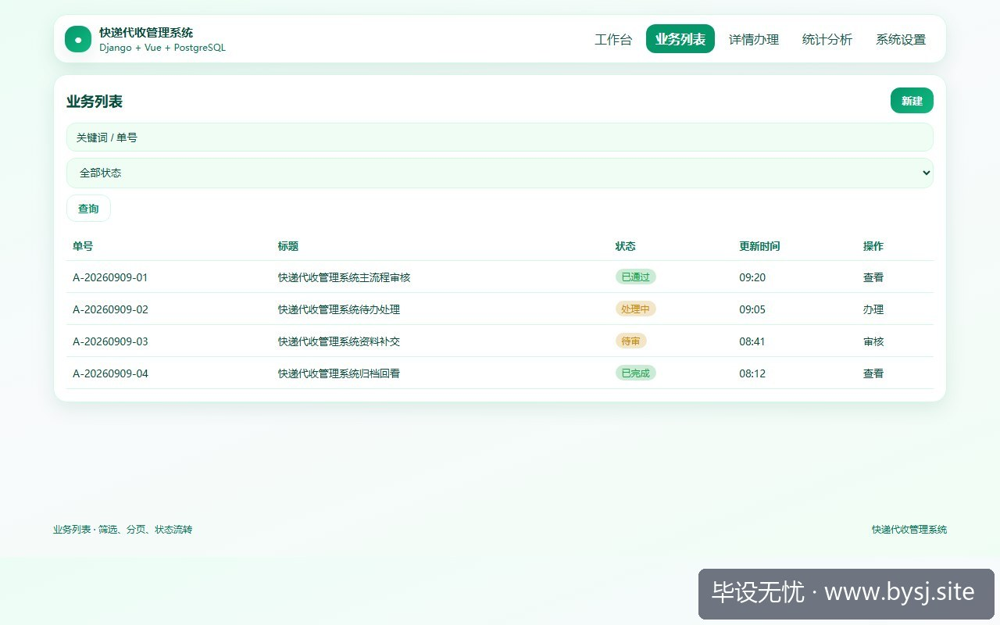
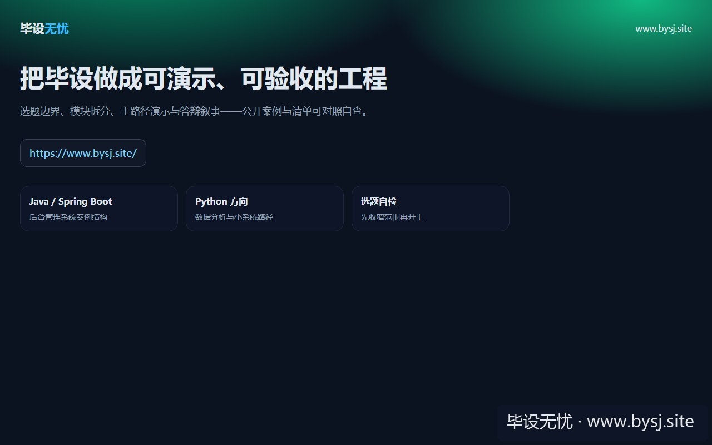

# 快递代收管理系统

[](https://www.bysj.site/)

> 对照草稿，不是可运行工程。完整案例见 [www.bysj.site](https://www.bysj.site/)

> 技术栈：Django + Vue + PostgreSQL
> 快递代收题目容易滑向短信、运单接口和智能柜联动。本文用件流转、货位容量与审核查询三条链判断可行性，给出最小表结构和可改写草稿。

## 本目录文件

- `verify_store.py`
- `to_view.py`
- `快递代收管理_flow.pseudo`
- `shots/20260925-110200_快递代收管理系统_先用件流转和货位容量审查毕设边界_ui_1.jpg`
- `shots/20260925-110200_快递代收管理系统_先用件流转和货位容量审查毕设边界_ui_2.jpg`
- `shots/20260925-110200_快递代收管理系统_先用件流转和货位容量审查毕设边界_ui_site.jpg`

## 说明

- 伪代码只描述主路径，表结构/状态机请自己落库实现。
- 禁止把本目录当作业直接提交。
- 选题边界与可演示清单： [www.bysj.site](https://www.bysj.site/)

### 站点封面（仓库本地 assets）


## 原文摘要

> 快递代收题目容易滑向短信、运单接口和智能柜联动。本文用件流转、货位容量与审核查询三条链判断可行性，给出最小表结构和可改写草稿。
> 示例系统：快递代收管理系统
> tags: 计算机毕设, Django, Vue, PostgreSQL, 快递代收管理系统, 系统设计, 伪代码

周三晚上，快递代收管理系统的开题演示卡在一句报错：`Third-party tracking API: 401 Unauthorized`。原计划还包括短信提醒、菜鸟接口、智能柜格口同步和用户自助取件。指导老师问得很直接：如果外部接口今天不可用，系统还剩下什么？

我的判断是，快递代收毕设首先要证明“包裹进入站点后，能被准确接收、分配、查询并核销”，而不是证明自己能接入多少平台。把这条主链跑通，题目才有稳定的演示边界。

## 开题记录：同一个题目，范围差别很大



*图：快递代收管理系统工作台演示*


| 方案 | 核心依赖 | 演示风险 | 适合作为默认范围 |
|---|---|---|---|
| 外部运单聚合 | 商业接口、授权、字段映射 | 高，接口权限未知 | 否 |
| 智能柜联动 | 硬件或模拟设备、异步状态 | 高，现场容易断链 | 否 |
| 站内代收管理 | 本地包裹、货位、取件核销 | 低，数据可控 | 是 |
| 加入短信通知 | 短信网关、模板审核 | 中，消息发送不可控 | 作为可选展示 |

默认范围只保留三类角色：管理员负责站点和货位维护，工作人员负责入库与审核，学生负责查询和取件核销。登录、分页、模糊查询可以做，但不应抢走件流转的时间。

### 先写清楚什么不做

本项目不抓取真实快递平台数据，不校验真实物流轨迹，也不把短信发送作为取件成功的前置条件。包裹编号由工作人员录入，取件码由系统生成或由演示数据导入。这样做不是降低系统价值，而是把不可控的网络服务从主流程移开。

唯一推荐的技术栈是 Django + Vue + PostgreSQL。Django 负责权限、接口和事务，Vue 做工作人员端与学生查询页，PostgreSQL 保存状态和约束。只有在确实需要多实例部署、实时推送或海量日志时，才考虑 Redis；单机课程设计不要因为“以后可能扩展”提前加入消息队列。

## 第一次试做：先接接口，结果反而无法验收



*图：快递代收管理系统业务列表*


失败尝试是直接调用快递平台查询接口，用返回的物流状态填充包裹详情。问题不在代码，而在前置条件：测试账号没有稳定权限，返回字段也无法保证包含站点货位。接口偶尔成功时，系统看起来很完整；接口失效时，工作人员连一件包裹都无法入库。

意外的是，去掉外部物流状态后，查询页更容易验证。学生只需要输入取件码或手机号后四位，就能看到“待审核、已入库、已取件、异常”中的一个明确状态。答辩时可以现场修改状态并核对操作记录，反而比展示一条无法解释来源的物流时间线更可靠。

这个判断有一个切换条件：如果学校已经提供稳定、可长期使用的测试接口，并能确认字段、调用次数和授权期限，才值得把物流同步作为扩展模块；否则它不应进入核心用例。

## 最小模块和表结构：让每个字段服务一个动作

模块只拆成四块：

1. 用户与角色：区分管理员、工作人员、学生。
2. 包裹接收：录入运单号、收件人和来源信息，进入待审核。
3. 货位与审核：检查包裹信息，分配货架位置，确认入库。
4. 查询与核销：凭取件码查询，工作人员核对后完成取件。

建议最小表结构如下，字段名称可按自己的实现调整：

```text
user(id, username, password_hash, role, is_active)
parcel(id, tracking_no, receiver_name, receiver_phone4,
       pickup_code, status, created_at, verified_at, picked_at)
storage_slot(id, code, capacity, used_count, is_enabled)
parcel_slot(id, parcel_id, slot_id, assigned_at, released_at)
operation_log(id, parcel_id, operator_id, action, remark, created_at)
```

`parcel.status`建议只允许 `PENDING、STORED、PICKED、EXCEPTION`。货位不要直接写进包裹表，单独的关联表能保留换位记录。容量控制也不能只在页面上判断；在 PostgreSQL 事务中更新 `used_count`，否则两个工作人员同时入库时可能出现超容量。

在校园快递量约为每天 200 件、单站点单机部署的条件下，上述结构足够支撑课堂演示和常规查询。若数据增长到数十万件且需要复杂历史检索，再考虑归档或专门的搜索方案；这不是默认配置。

## 核心用例：审核入库要同时占货位

下面是示意伪代码，不是可直接提交的完整实现。关键点是：包裹状态、货位容量和操作日志要在同一事务中处理。

```text
# 示意伪代码：审核包裹并分配货位
function verify_and_store(parcel_id, slot_id, operator_id):
    begin transaction
    parcel = lock parcel where id = parcel_id
    slot = lock storage_slot where id = slot_id

    if parcel is null or parcel.status != 'PENDING':
        rollback
        return '包裹状态不允许审核'
    if slot is null or slot.is_enabled is false:
        rollback
        return '货位不可用'
    if slot.used_count >= slot.capacity:
        rollback
        return '货位已满'

    create parcel_slot(parcel_id, slot_id, assigned_at=now())
    update storage_slot set used_count = used_count + 1
    update parcel set status = 'STORED', verified_at = now()
    create operation_log(parcel_id, operator_id, 'VERIFY_STORE', '')
    commit
    return '入库成功'
```

查询用例可以只返回脱敏后的手机号后四位、货位编码和状态。核销时再次锁定包裹，确认状态为 `STORED` 后写入 `PICKED`，并释放货位。这样“查到包裹”和“完成取件”不会被混成一个接口。

## 仓库草稿：把业务判断留在服务层

以下为 `parcel_service.py` 的对照草稿，不能替代你自己的模型、权限和异常处理：

```python
# 示意草稿：Service 层
@transaction.atomic
def verify_store(parcel_id, slot_id, operator):
    parcel = Parcel.objects.select_for_update().get(id=parcel_id)
    slot = StorageSlot.objects.select_for_update().get(id=slot_id)

    if parcel.status != 'PENDING':
        raise DomainError('parcel cannot be verified')
    if not slot.is_enabled or slot.used_count >= slot.capacity:
        raise DomainError('slot unavailable')

    ParcelSlot.objects.create(parcel=parcel, slot=slot)
    slot.used_count += 1
    slot.save(update_fields=['used_count'])
    parcel.status = 'STORED'
    parcel.verified_at = timezone.now()
    parcel.save(update_fields=['status', 'verified_at'])
    OperationLog.objects.create(
        parcel=parcel, operator=operator, action='VERIFY_STORE'
    )
```

查询接口只负责接收参数和返回结果，不能让 Vue 页面自己拼接状态。可以准备一个 `parcel_mapper.py` 草稿，把数据库对象转换成稳定的展示字段：

```python
# 示意草稿：查询映射
STATUS_TEXT = {
    'PENDING': '待审核',
    'STORED': '已入库',
    'PICKED': '已取件',
    'EXCEPTION': '异常'
}

def to_view(parcel):
    slot = parcel.active_slot()
    return {
        'trackingNo': parcel.tracking_no,
        'receiverName': parcel.receiver_name,
        'phone4': parcel.receiver_phone4,
        'status': STATUS_TEXT.get(parcel.status, '未知'),
        'slotCode': slot.slot.code if slot else None
    }
```

## 演示预算：四个页面足够形成证据链

按课程设计的展示范围，准备登录页、包裹审核页、货位查询页和取件核销页即可。演示数据应包含一件待审核包裹、一件已入库包裹、一件已取件包裹和一个满货位，这样能覆盖正常路径与拒绝路径。

答辩时最值得展示的不是按钮数量，而是三个结果：满货位不能继续入库，已取件包裹不能重复核销，审核记录能追溯到操作人。若这三处成立，系统边界就是可解释的；若还需要依赖短信、实时物流或智能柜才能证明功能，说明选题范围仍然没有收紧。



*图：毕设无忧网站入口（www.bysj.site）*

