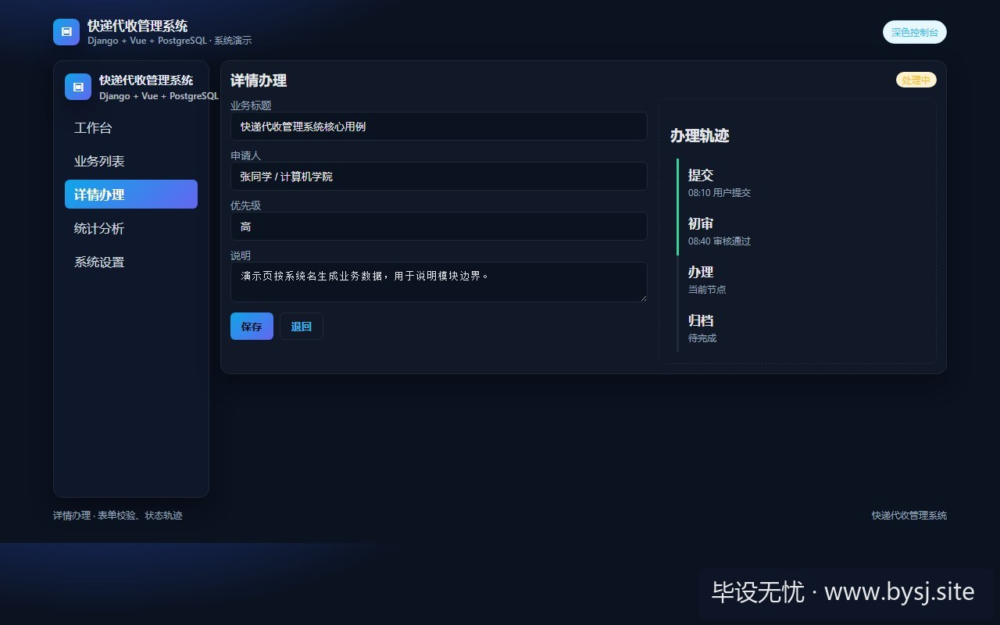
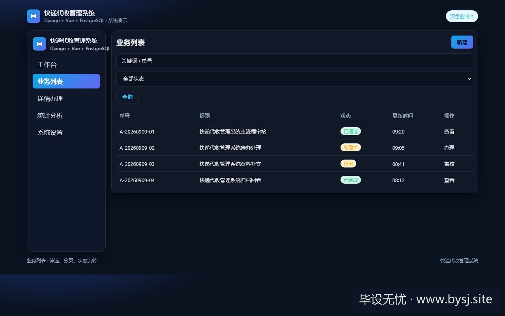
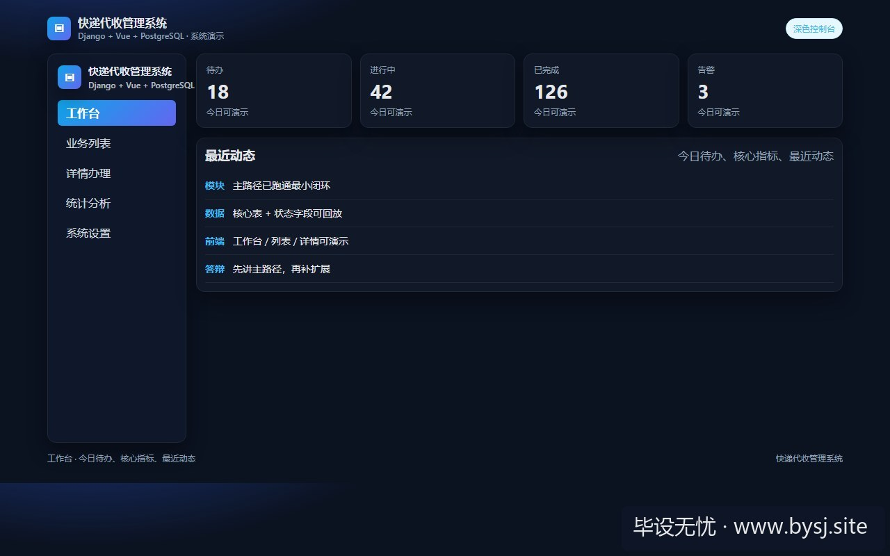

# 快递代收管理系统

[](https://www.bysj.site/)

> 对照草稿，不是可运行工程。完整案例见 [www.bysj.site](https://www.bysj.site/)

> 技术栈：Django + Vue + PostgreSQL
> 很多快递代收毕设开题就写智能硬件柜联动与真实短信下发，中期卡在短信模板未备案和单片机通信丢包。本文砍掉外部硬件与计费网关，收敛为货架层位映射与原子核销，给出核心表结构、分配伪代码与Django关键草稿，保障演示流转。

## 本目录文件

- `Shelf.py`
- `ParcelService.py`
- `快递代收管理_flow.pseudo`
- `shots/20260909-205431_做快递代收别接硬件柜与短信网关_6位取件码防碰与入库两段式的Django预算_ui_3.jpg`
- `shots/20260909-205431_做快递代收别接硬件柜与短信网关_6位取件码防碰与入库两段式的Django预算_ui_2.jpg`
- `shots/20260909-205431_做快递代收别接硬件柜与短信网关_6位取件码防碰与入库两段式的Django预算_ui_1.jpg`
- `shots/20260909-205431_做快递代收别接硬件柜与短信网关_6位取件码防碰与入库两段式的Django预算_ui_site.jpg`

## 说明

- 伪代码只描述主路径，表结构/状态机请自己落库实现。
- 禁止把本目录当作业直接提交。
- 选题边界与可演示清单： [www.bysj.site](https://www.bysj.site/)

### 站点封面（仓库本地 assets）


## 原文摘要

> 很多快递代收毕设开题就写智能硬件柜联动与真实短信下发，中期卡在短信模板未备案和单片机通信丢包。本文砍掉外部硬件与计费网关，收敛为货架层位映射与原子核销，给出核心表结构、分配伪代码与Django关键草稿，保障演示流转。
> 示例系统：快递代收管理系统
> tags: 毕业设计, Django, PostgreSQL, 快递代收, 系统架构

### 现场：第三周开题评审被截停的一页PPT

开题答辩现场，评委老师翻到第 9 页的技术架构图，直接指着中间两个模块打断：“你这里画了 ESP32 串口驱动智能快递柜、还要对接阿里云短信通知。你拿什么在答辩教室演示开柜？欠费了谁付钱？短信没备案能发得出去？”



*图：快递代收管理系统详情办理*




*图：快递代收管理系统业务列表*




*图：快递代收管理系统工作台演示*


很多做快递代收题目的同学，开题报告直接抄商业商业方案：写了硬件柜蓝牙通信、OCR 运单扫描、第三方短信通知、高德地图轨迹。结果进入第 5 周，光是申请云平台的通知短信模板，就因为个人账号缺少 ICP 备案和营业执照被驳回了 3 次，控制台一直报 `AliyunSMSClientException: Invalid Template Code`。后台为了发短信一直挂起，入库请求直接超时报 504。

本篇把快递代收管理系统收拢在单机能演示完整的边界内：拿掉不可控的外部硬件柜通信和付费短信通道，用确定性的货架物理位映射和站内取件码核销，把核心精力放在数据一致性上。

---

### 意外信息：踩过的短信调试与串口死胡同

很多人以为接短信 SDK 很简单，只是一行 API 调用。下面是开发过程中真实发生过的阻塞链条：

1. **短信渠道死胡同**：个人认证的云厂商账号不支持自定义签名与非验证码类通用模板。为了演示，尝试购买第三方小平台的发卡接口，结果答辩预演前一天，接口域名被工信部拦截，入库线程在等待 HTTP 回调时阻塞了 30 秒，演示系统直接假死。
2. **硬件串口通信死胡同**：尝试用树莓派搭一个 4 格的模拟亚克力柜子，用蓝牙跟服务端通信。但答辩教室有上百台手机和 Wi-Fi 信号，蓝牙 2.4GHz 频段严重干扰，现场发送“出库开锁”指令后延时超过 8 秒，甚至直接丢包超时。

**处理方式**：
彻底剔除外部硬件通信与外部短信，改在系统内做两件事：
- 入库后在系统内生成一条带时间戳的站内通知单，前端提供“模拟通知弹框”；
- 取件码彻底放弃全随机 6 位纯数字，改为与物理货架直接关联的确定性编码。

#### 两种方案的开发与演示成本对照

| 对比维度 | 硬件柜联动 + 真实短信通道 | 单体 Django + 虚拟货架位 + 站内核销 |
| :--- | :--- | :--- |
| 外部硬性依赖 | 需采购单片机/舵机/短信包（均需备案） | 仅需单机 Python 3.10 与 PostgreSQL 14 |
| 接口超时风险 | 网络抖动导致入库请求阻塞 3~10 秒 | 纯单库事务执行，耗时 < 15ms |
| 取件码撞码概率 | 6 位纯随机数在单日 2000 件时碰撞率升高 | 货架区-排-层-自增序号，碰撞概率为 0 |
| 答辩现场翻车点 | 蓝牙掉线、短信欠费、基站屏蔽 | 本地 Localhost 自闭环，无外部网络依赖 |

---

### 唯一推荐与反驳条件

**本篇唯一推荐**：取件码必须采用“货架物理分区编码 + 库位编号”的确定性组合（例如 `A02-3-018` 表示 A 库区 2 号货架 3 层 18 号位），放弃无序的 6 位随机验证码。

*为什么这么选*：纯随机 6 位数字需要维护复杂的分布式防重 Key，且在学生做系统演示时，如果现场找不到物理货架对应关系，评委问一句“取件码是 839201，店员去哪个货架找包裹”，界面如果展示不出物理路径，业务逻辑直接穿帮。

*收回该判断的条件*：除非学校实验室内有现成的自动化分拣立库，且包裹进出由机械臂扫条形码自动抓取，无需人工根据取件码肉眼找货。

---

### 模块边界拆分与数据结构

系统无需微服务拆解，在单个 Django 应用内划清四个关键模块：

1. **入库登记模块**：扫描或录入运单号与手机号，检测当前货架是否有空位，生成确定性取件码，写包裹表并占用货位；
2. **货位调度模块**：维护货架容量上限，若预设货架已满，自动溢出流转至暂存区（Overflow Area）；
3. **核销出库模块**：支持“手机号检索”与“取件码核验”，核销后释放货位，包裹状态跃迁为已签收；
4. **滞留预警模块**：扫描超过 72 小时未取的包裹，触发滞留标志，支持批量标记。

```
+-------------------------------------------------------------+
|                   快递代收管理系统模块拓扑                  |
+-------------------------------------------------------------+
                               |
       +-----------------------+-----------------------+
       |                                               |
       v                                               v
+-----------------------+                   +-----------------------+
|     入库与货位调度    |                   |     出库核销模块      |
| 1. 录入单号/手机号    |                   | 1. 取件码/手机号检索  |
| 2. 计算目标货位       |                   | 2. 状态校验(必须待取) |
| 3. 生成 A-01-02 编码  |                   | 3. 释放货位容量       |
| 4. 货架计数原子加 1   |                   | 4. 写入出库审计流水   |
+-----------------------+                   +-----------------------+
               |                                       |
               +-------------------+-------------------+
                                   |
                                   v
                    +-----------------------------+
                    | PostgreSQL 14 核心关系库     |
                    | - tb_shelf (货架容量管理)   |
                    | - tb_parcel (包裹主状态表)  |
                    | - tb_pickup_log (核销审计表)|
                    +-----------------------------+
```

#### 最小核心表设计 (PostgreSQL)

在 Django 的 `models.py` 中，定义如下三张核心表，重点关注字段约束与索引：

```python
# models.py (对照草稿，按需补充完整)
from django.db import models
from django.utils import timezone

class Shelf(models.Model):
    code = models.CharField(max_length=16, unique=True, verbose_name="货架编号(如A01)")
    capacity = models.PositiveIntegerField(default=50, verbose_name="最大容纳量")
    current_count = models.PositiveIntegerField(default=0, verbose_name="当前在架量")

    class Meta:
        db_table = "tb_shelf"

class Parcel(models.Model):
    STATUS_CHOICES = (
        (0, "待取件"),
        (1, "已签收"),
        (2, "异常/退件"),
    )
    tracking_number = models.CharField(max_length=64, unique=True, verbose_name="快递单号")
    recipient_phone = models.CharField(max_length=11, db_index=True, verbose_name="收件人手机")
    shelf = models.ForeignKey(Shelf, on_delete=models.PROTECT, related_name="parcels")
    pickup_code = models.CharField(max_length=32, unique=True, verbose_name="物理取件码")
    status = models.SmallIntegerField(choices=STATUS_CHOICES, default=0, db_index=True)
    inbound_time = models.DateTimeField(default=timezone.now, verbose_name="入库时间")
    outbound_time = models.DateTimeField(null=True, blank=True, verbose_name="出库时间")

    class Meta:
        db_table = "tb_parcel"

class PickupAuditLog(models.Model):
    parcel = models.ForeignKey(Parcel, on_delete=models.CASCADE, verbose_name="关联包裹")
    operator_name = models.CharField(max_length=32, verbose_name="经办店员")
    action_time = models.DateTimeField(default=timezone.now, verbose_name="操作时间")
    verify_type = models.CharField(max_length=16, default="CODE", verbose_name="核销方式")

    class Meta:
        db_table = "tb_pickup_log"
```

---

### 核心用例：入库分配与核销出库算法

入库操作绝不能简单地 `save()`。在有并发扫码或连续扫码场景下，货架容量超卖是典型翻车点。

```text
ALGORITHM: ParcelInbound(tracking_num, phone, target_shelf_id)
INPUT: tracking_num (字符串), phone (11位手机号), target_shelf_id (整数)
OUTPUT: Result (成功附带取件码，或失败原因)

BEGIN TRANSACTION
    1. SELECT * FROM tb_shelf WHERE id = target_shelf_id FOR UPDATE
    2. IF shelf.current_count >= shelf.capacity THEN
           ROLLBACK
           RETURN Error("指定货架已满，请调度至暂存区")
       END IF
    3. sequence_num = shelf.current_count + 1
    4. pickup_code = FORMAT("{0}-{1:03d}", shelf.code, sequence_num)
    5. INSERT INTO tb_parcel (tracking_number, recipient_phone, shelf_id, pickup_code, status, inbound_time)
       VALUES (tracking_num, phone, target_shelf_id, pickup_code, 0, NOW())
    6. UPDATE tb_shelf SET current_count = current_count + 1 WHERE id = target_shelf_id
COMMIT
RETURN Success(pickup_code)
```

---

### 服务层代码草稿：事务控制与防并发核销

下面给出一个约 35 行的业务服务层实现，展示出库核销时的防并发重复出库控制。请根据自己工程目录结构组织，不要直接当成开箱即用成品。

```python
# services.py (对照草稿，读者需自行完善异常细分)
from django.db import transaction
from django.utils import timezone
from .models import Parcel, Shelf, PickupAuditLog

class ParcelService:
    @staticmethod
    def verify_and_pickup(pickup_code: str, operator_name: str) -> bool:
        """
        执行核销出库：排他锁行记录，校验状态，释放货架库位，记录日志
        """
        with transaction.atomic():
            # 使用 select_for_update 防止同一取件码被多窗口连击并发核销
            parcel = Parcel.objects.select_for_update().filter(pickup_code=pickup_code).first()
            if not parcel:
                raise ValueError("未找到该取件码对应的包裹")
            
            if parcel.status != 0:
                raise ValueError(f"包裹状态异常，当前状态代码为：{parcel.status}，不可重复核销")
            
            # 更新包裹状态
            parcel.status = 1
            parcel.outbound_time = timezone.now()
            parcel.save(update_fields=["status", "outbound_time"])
            
            # 货架在架计数原子减 1
            Shelf.objects.filter(id=parcel.shelf_id).update(
                current_count=models.F("current_count") - 1
            )
            
            # 记录审计日志
            PickupAuditLog.objects.create(
                parcel=parcel,
                operator_name=operator_name,
                verify_type="PICKUP_CODE"
            )
            return True
```

---

### 今晚能在本地推进的 3 个动作

1. **修改开题任务书**：把“接入智能快递柜硬件串口”和“对接阿里云短信网关”两句话删掉，替换为“实现基于行级排他锁的货架库位调度算法与两步核销审计”。
2. **初始化 PostgreSQL 数据库**：新建 `tb_shelf`、`tb_parcel` 和 `tb_pickup_log` 三张表，手动通过 SQL 插入 2 个测试货架（例如 A01、A02，容量各设为 20）。
3. **本地冒烟测试**：用 Django Shell 连续调用 2 次出库函数，确认第二次调用能准确抛出“不可重复核销”业务异常，而不是让数据库静默覆盖。


*图：毕设无忧网站入口（www.bysj.site）*

