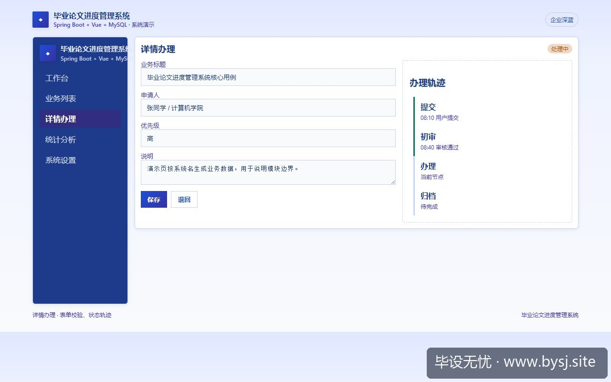
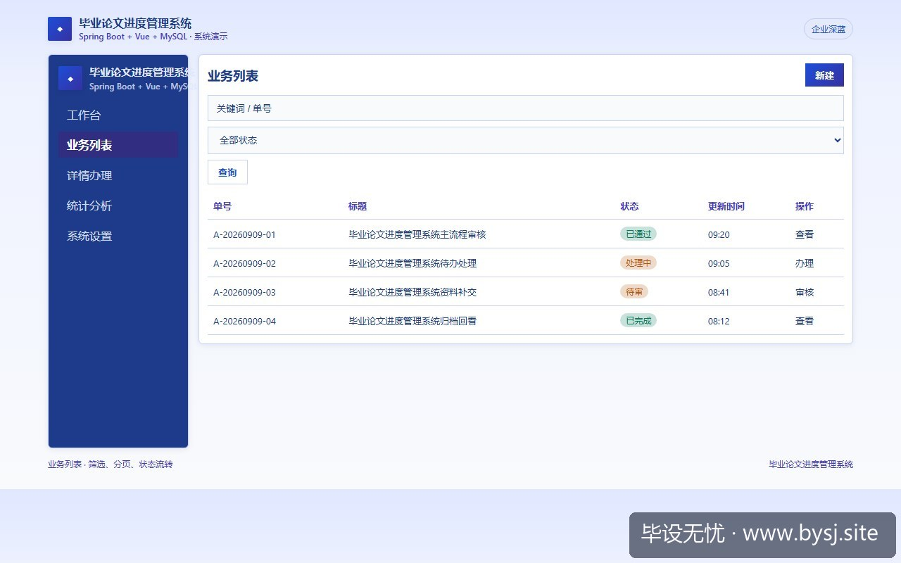
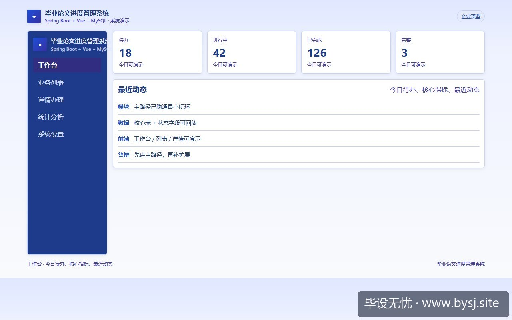
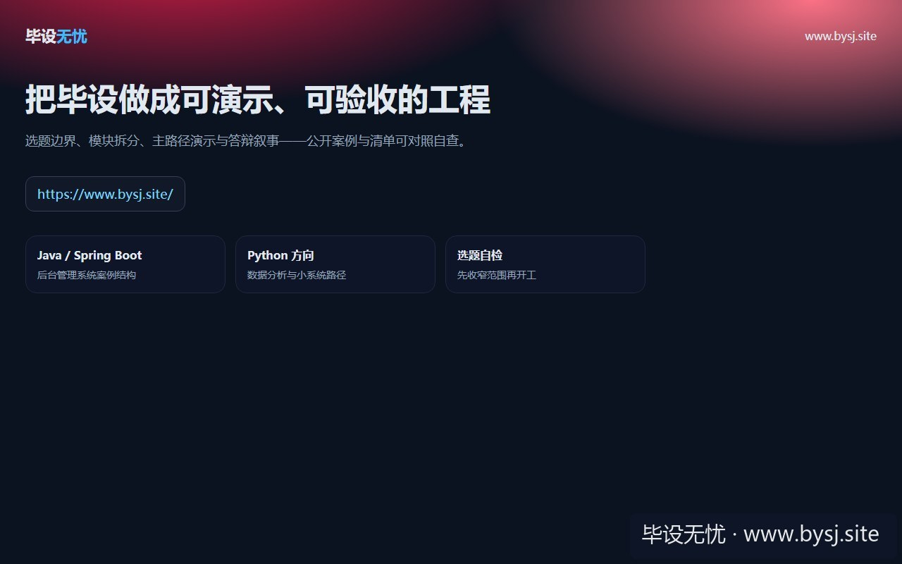

# 毕业论文进度管理系统

[](https://www.bysj.site/)

> 对照草稿，不是可运行工程。完整案例见 [www.bysj.site](https://www.bysj.site/)

> 技术栈：Spring Boot + Vue + MySQL
> 很多做进度管理毕设的学生开题就塞实时协作与第三方查重接口，中期卡在并发编辑锁死与API按篇收费。本文将系统边界收窄至节点提交与师生双向审核，给出4张核心表、状态流转伪代码与评审Service草稿，守住演示底线。

## 本目录文件

- `毕业论文进度管理_schema.sql`
- `SubmissionReviewService.java`
- `MilestoneSubmissionMapper.java`
- `毕业论文进度管理_flow.pseudo`
- `shots/20260910-102042_毕业论文进度系统剔除在线协同与查重API_四节点状态流与单库事务拆解_ui_3.jpg`
- `shots/20260910-102042_毕业论文进度系统剔除在线协同与查重API_四节点状态流与单库事务拆解_ui_2.jpg`
- `shots/20260910-102042_毕业论文进度系统剔除在线协同与查重API_四节点状态流与单库事务拆解_ui_1.jpg`
- `shots/20260910-102042_毕业论文进度系统剔除在线协同与查重API_四节点状态流与单库事务拆解_ui_site.jpg`

## 说明

- 伪代码只描述主路径，表结构/状态机请自己落库实现。
- 禁止把本目录当作业直接提交。
- 选题边界与可演示清单： [www.bysj.site](https://www.bysj.site/)

### 站点封面（仓库本地 assets）


## 原文摘要

> 很多做进度管理毕设的学生开题就塞实时协作与第三方查重接口，中期卡在并发编辑锁死与API按篇收费。本文将系统边界收窄至节点提交与师生双向审核，给出4张核心表、状态流转伪代码与评审Service草稿，守住演示底线。
> 示例系统：毕业论文进度管理系统
> tags: SpringBoot, 毕业设计, 系统设计, 状态机, MySQL

### 开题现场的死循环

第 5 周中期检查预答辩，评审老师翻完系统演示提了两个问题：



*图：毕业论文进度管理系统详情办理*




*图：毕业论文进度管理系统业务列表*




*图：毕业论文进度管理系统工作台演示*

「你写的这个开题报告在线协作，学生改第一段、老师改第二段，断网重连后版本怎么合并？」
「你写了对接中国知网或维普自动查重，答辩时我们真拿一篇 docx 扔进去，账号里的查重额度谁来付？」

很多人设计「毕业论文进度管理系统」时，习惯照搬商业协作工具。开题报告里写满协同文档编辑、智能相似度比对、富文本批注、全自动催交短信。结果在宿舍调了三周 Quill 和 WebSocket，两个页面并发打字直接光标乱跳，控制台报 `IndexSizeError: Failed to execute 'deleteData' on 'CharacterData'`。最后论文上传变成了格式乱七八糟的 HTML 字符串，存储在 MySQL 的 `text` 字段里连换行符都丢了。

### 真实踩坑复盘：协同编辑与查重调用的死胡同

我最初尝试给学生端和导师端做一套「实时批注画布」，用开源的协同算法配合富文本：

1. 前端加载 15000 字的论文初稿，直接把 DOM 树节点转换成协同操作事件，只要网络有 200ms 抖动，光标偏移计算就会错乱，导师划选的评语直接挂在下一章的标题上。
2. 第三方查重接口根本没有面对个人开发者的免费沙箱。部分小平台的按篇计费 API 每次请求 15 到 30 元，且解析 docx 耗时经常超过 40 秒，本地 Spring Boot 默认的 Tomcat 线程池（200 线程）在压测脚本跑 10 个并发时就出现了连接超时挂起。

停掉这套设计的界限非常明确：如果一个功能既没有免费开放的稳定协议，又引入了非幂等的外部付费依赖，它就绝对不应该进入毕业设计的核心调用链路。

### 功能边界与可行性对照

毕业论文进度的本质不是「协同创作工具」，而是「带有阶段截止时限的节点交付与审计台账」。下表是功能取舍的实际对照：

| 功能模块 | 过度设计（容易烂尾） | 收敛后的可交付边界（推荐） | 答辩时老师关心的指标 |
| :--- | :--- | :--- | :--- |
| 论文修改 | 协同富文本实时批注 (OT/CRDT) | 增量版本文件上传 (PDF/DOCX) + 结构化打分评语 | 历史版本对比、时间戳记录 |
| 评审流转 | Activiti / Camunda 工作流引擎 | 4 个线性状态驱动的单表更新 (通过/驳回) | 状态流向清晰、驳回原因追溯 |
| 查重验证 | 接入商业查重 API 实时抓取 | 线下查重报告 PDF 上传 + 结构化比例录入 | 查重率阈值阻断 (如 > 20% 禁止定稿) |
| 进度提醒 | 真实短信网关 / 微信模板消息 | 站内公告表 + 登录看板倒计时计算 | 阶段截止时间校验、延期拦截 |

### 选型唯一推荐与切换条件

技术栈唯一推荐：**Spring Boot 2.7 / 3.x + Vue 3 (Element Plus) + MySQL 8.0**。

为什么不要工作流引擎：很多学生觉得审批流必须上 Activiti 或 Camunda。实际在单体毕设里，一个包含 23 张引擎预置表的框架会占满你一半的代码讲解时间，答辩老师问一句「HistoricProcessInstance 怎么清理」，学生立刻支支吾吾。只有一种情况你需要上引擎：学院明确要求多教研室会签、跨院系平行评审，且有至少 3 个并行动态分支。只要还是「学生提交 → 指导老师审核 → 评阅老师复核」的线性顺序，单库状态枚举字段足以支撑全部业务。

### 四个核心节点的状态流设计

进度系统只管 4 个阶段：开题报告（PROPOSAL）、中期检查（MID_TERM）、论文终稿（FINAL_PAPER）、答辩答卷（DEFENSE）。

每个阶段严格遵循以下伪代码定义的单向闭环：

```pseudo
ENUM PhaseStatus {
    UNSUBMITTED = 0, // 未提交
    SUBMITTED   = 1, // 已提交/待评审
    REJECTED    = 2, // 已驳回/待修改
    PASSED      = 3  // 已通过
}

FUNCTION ReviewSubmission(studentId, phase, action, comment):
    FETCH currentRecord FROM milestone_submission WHERE student_id = studentId AND phase = phase
    IF currentRecord IS NULL THEN
        THROW Exception("该阶段提交记录不存在")
    
    IF currentRecord.status != SUBMITTED THEN
        THROW Exception("当前记录非待审核状态，禁止变更")
        
    IF action == "PASS" THEN
        UPDATE milestone_submission 
        SET status = PASSED, reviewer_comment = comment, update_time = NOW()
        WHERE id = currentRecord.id AND status = SUBMITTED
        
        IF phase != DEFENSE THEN
            UNLOCK NextPhase(studentId, phase + 1)
        END IF
    ELSE IF action == "REJECT" THEN
        UPDATE milestone_submission 
        SET status = REJECTED, reviewer_comment = comment, update_time = NOW()
        WHERE id = currentRecord.id AND status = SUBMITTED
    END IF
```

### 最小核心表结构（4张表支撑全流程）

系统不需要十几张表，4 张表就能支撑学生选报题目、阶段提交、打回整改与评阅打分。

```sql
-- 1. 用户基础表（学生/导师/管理员）
CREATE TABLE `sys_user` (
  `id` BIGINT AUTO_INCREMENT PRIMARY KEY,
  `work_no` VARCHAR(32) NOT NULL UNIQUE COMMENT '学号或工号',
  `real_name` VARCHAR(32) NOT NULL COMMENT '姓名',
  `role` VARCHAR(16) NOT NULL COMMENT 'STUDENT/TEACHER/ADMIN',
  `phone` VARCHAR(11) DEFAULT NULL,
  `create_time` DATETIME NOT NULL DEFAULT CURRENT_TIMESTAMP
) ENGINE=InnoDB DEFAULT CHARSET=utf8mb4;

-- 2. 论文档案与选题分配表
CREATE TABLE `topic` (
  `id` BIGINT AUTO_INCREMENT PRIMARY KEY,
  `title` VARCHAR(128) NOT NULL COMMENT '论文题目',
  `student_id` BIGINT NOT NULL UNIQUE COMMENT '学生ID(一对一)',
  `advisor_id` BIGINT NOT NULL COMMENT '指导教师ID',
  `academic_year` VARCHAR(9) NOT NULL COMMENT '例如 2025-2026',
  `is_active` TINYINT(1) NOT NULL DEFAULT 1,
  INDEX `idx_advisor` (`advisor_id`)
) ENGINE=InnoDB DEFAULT CHARSET=utf8mb4;

-- 3. 阶段提交明细表（存储每个节点的物料与状态）
CREATE TABLE `milestone_submission` (
  `id` BIGINT AUTO_INCREMENT PRIMARY KEY,
  `student_id` BIGINT NOT NULL,
  `phase_code` VARCHAR(16) NOT NULL COMMENT 'PROPOSAL/MID_TERM/FINAL_PAPER',
  `version_no` INT NOT NULL DEFAULT 1 COMMENT '第几次修改版本',
  `file_url` VARCHAR(255) NOT NULL COMMENT '阶段文档MinIO或本地相对路径',
  `plagiarism_rate` DECIMAL(4,2) DEFAULT NULL COMMENT '查重率百分比，如 12.50',
  `status` TINYINT NOT NULL DEFAULT 0 COMMENT '0待提交 1待审核 2驳回 3通过',
  `submit_time` DATETIME DEFAULT NULL,
  `update_time` DATETIME NOT NULL DEFAULT CURRENT_TIMESTAMP,
  UNIQUE KEY `uk_student_phase_version` (`student_id`, `phase_code`, `version_no`),
  INDEX `idx_status` (`status`)
) ENGINE=InnoDB DEFAULT CHARSET=utf8mb4;

-- 4. 导师评审记录台账（防篡改审计轨迹）
CREATE TABLE `review_log` (
  `id` BIGINT AUTO_INCREMENT PRIMARY KEY,
  `submission_id` BIGINT NOT NULL COMMENT '关联阶段记录ID',
  `reviewer_id` BIGINT NOT NULL COMMENT '评审教师ID',
  `review_action` VARCHAR(16) NOT NULL COMMENT 'PASS / REJECT',
  `score` INT DEFAULT NULL COMMENT '阶段评分(百分制)',
  `comment` VARCHAR(500) NOT NULL COMMENT '评审意见',
  `create_time` DATETIME NOT NULL DEFAULT CURRENT_TIMESTAMP,
  INDEX `idx_sub_id` (`submission_id`)
) ENGINE=InnoDB DEFAULT CHARSET=utf8mb4;
```

### 核心业务代码实现草稿

以下两段代码是整个系统的业务中枢。评审动作必须具备原子性：既要校验前置阶段是否达标，又要防止多点登录下的并发状态覆盖。

#### 阶段审批服务类草稿

```java
// SubmissionReviewService.java (示意草稿，读者根据持久层框架自行装配)
package com.example.thesis.service;

import org.springframework.stereotype.Service;
import org.springframework.transaction.annotation.Transactional;
import com.example.thesis.mapper.MilestoneSubmissionMapper;
import com.example.thesis.mapper.ReviewLogMapper;

@Service
public class SubmissionReviewService {
    private final MilestoneSubmissionMapper submissionMapper;
    private final ReviewLogMapper reviewLogMapper;

    public SubmissionReviewService(MilestoneSubmissionMapper submissionMapper, ReviewLogMapper reviewLogMapper) {
        this.submissionMapper = submissionMapper;
        this.reviewLogMapper = reviewLogMapper;
    }

    @Transactional(rollbackFor = Exception.class)
    public boolean executeReview(Long submissionId, Long teacherId, String action, String comment, Integer score) {
        // 1. 悲观锁或版本校验：锁定待审核记录
        var submission = submissionMapper.selectByIdForUpdate(submissionId);
        if (submission == null || submission.getStatus() != 1) {
            throw new IllegalStateException("提交记录不存在或非待审状态，操作已作废");
        }

        // 2. 查重硬指标限制：终稿阶段若查重率超过20%，系统禁止执行通过操作
        if ("FINAL_PAPER".equals(submission.getPhaseCode()) && "PASS".equals(action)) {
            if (submission.getPlagiarismRate() != null && submission.getPlagiarismRate().doubleValue() > 20.0) {
                throw new IllegalArgumentException("查重率高于 20.00%，系统红线拦截，不可评定为通过");
            }
        }

        // 3. 更新主阶段状态 (2:驳回, 3:通过)
        int nextStatus = "PASS".equalsIgnoreCase(action) ? 3 : 2;
        int rows = submissionMapper.updateStatus(submissionId, nextStatus);
        if (rows == 0) {
            throw new RuntimeException("状态已被其他线程刷新，更新失败");
        }

        // 4. 写流水日志
        reviewLogMapper.insertLog(submissionId, teacherId, action, score, comment);
        return true;
    }
}
```

#### 数据层行锁操作草稿

```java
// MilestoneSubmissionMapper.java (MyBatis 接口示意)
package com.example.thesis.mapper;

import org.apache.ibatis.annotations.*;

@Mapper
public interface MilestoneSubmissionMapper {

    @Select("SELECT * FROM milestone_submission WHERE id = #{id} FOR UPDATE")
    MilestoneSubmissionEntity selectByIdForUpdate(@Param("id") Long id);

    @Update("UPDATE milestone_submission SET status = #{newStatus}, update_time = NOW() " +
            "WHERE id = #{id} AND status = 1")
    int updateStatus(@Param("id") Long id, @Param("newStatus") Integer newStatus);
}
```

### 落地实现的有序排查步骤

1. **搭建基础权限拦截**：在 Spring Boot 中配置一个最朴素的 HandlerInterceptor，根据 token 取出当前用户的角色，只允许 STUDENT 调提交接口，只允许 TEACHER 调评审接口，避免在业务代码里写大批 `if (role.equals(...))`。
2. **固化版本递增规则**：学生重新上传被驳回的材料时，执行 `SELECT MAX(version_no) + 1` 写入新行，而不是直接 `UPDATE` 覆写原文件 URL。旧记录的 `status` 保持为驳回状态，这样在答辩演示时能在前端一键拉出「修改前后的历史版本比对」。
3. **文件本地化安全落盘**：不要为了高大上强行对接公有云 OSS。演示机器断网即死。直接在后端指定一个本地静态资源目录，上传文档统一重命名为 `学号_阶段_版本号.docx`，后端配置 `addResourceHandlers` 映射为下载 URL 即可。

答辩的核心是看数据流转链路是否经得起推敲。删掉不可控的在线协同编辑与外部收费查重，把精力收敛在「版本记录清晰、打回有据可查、查重指标阻断、状态单向流转」这四件事上，整个系统的演示就不会在离线或者弱网环境下出现无法收场的意外。



*图：毕设无忧网站入口（www.bysj.site）*

