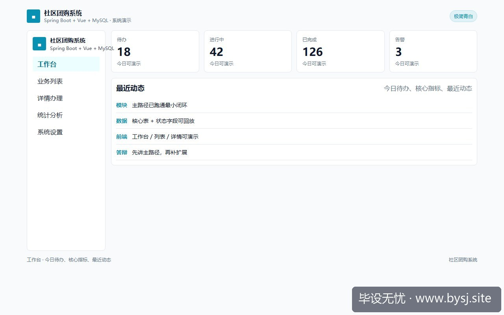
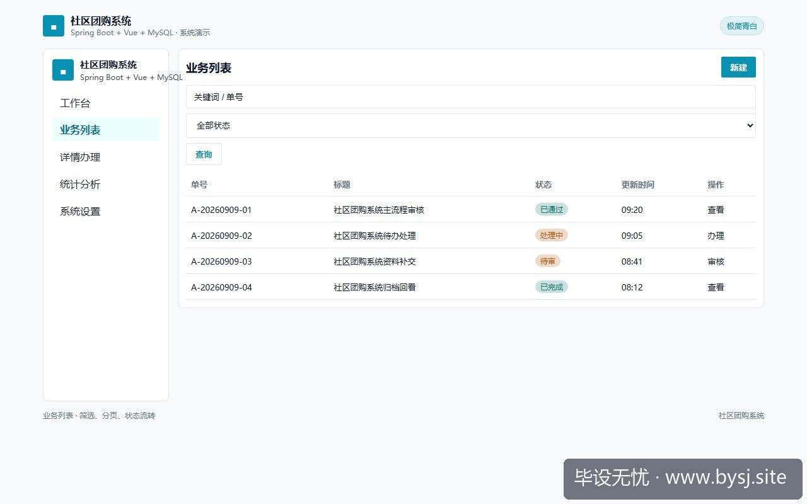
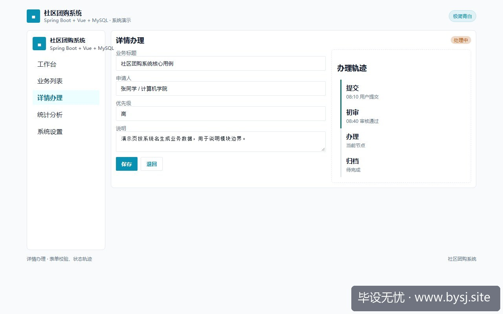
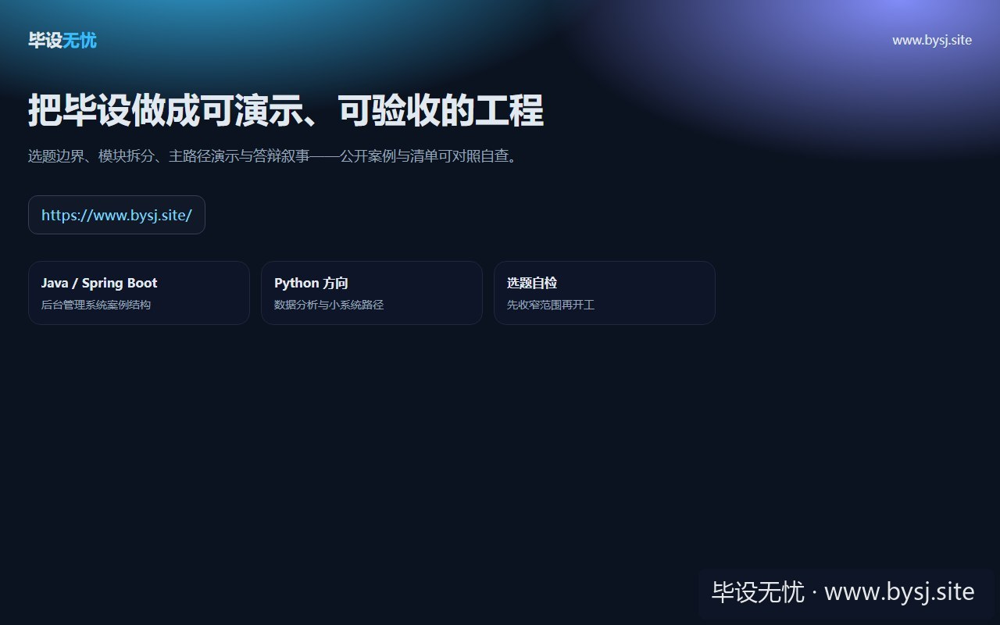

# 社区团购系统

[](https://www.bysj.site/)

> 对照草稿，不是可运行工程。完整案例见 [www.bysj.site](https://www.bysj.site/)

> 技术栈：Spring Boot + Vue + MySQL
> 社区团购毕设容易被团长、配送、退款和实时库存拖大。本文从选题边界出发，收敛为单库四表、四模块和一条可演示交易链。

## 本目录文件

- `GroupOrderService.java`
- `社区团购Service.java`
- `社区团购_flow.pseudo`
- `shots/20260925-102207_社区团购系统先算演示边界_Spring_Boot_四表事务草稿_ui_1.jpg`
- `shots/20260925-102207_社区团购系统先算演示边界_Spring_Boot_四表事务草稿_ui_2.jpg`
- `shots/20260925-102207_社区团购系统先算演示边界_Spring_Boot_四表事务草稿_ui_3.jpg`
- `shots/20260925-102207_社区团购系统先算演示边界_Spring_Boot_四表事务草稿_ui_site.jpg`

## 说明

- 伪代码只描述主路径，表结构/状态机请自己落库实现。
- 禁止把本目录当作业直接提交。
- 选题边界与可演示清单： [www.bysj.site](https://www.bysj.site/)

### 站点封面（仓库本地 assets）


## 原文摘要

> 社区团购毕设容易被团长、配送、退款和实时库存拖大。本文从选题边界出发，收敛为单库四表、四模块和一条可演示交易链。
> 示例系统：社区团购系统
> tags: 毕业设计, 课程设计, 社区团购系统, Spring Boot, Vue, MySQL, 系统设计

第 3 周组会上，老师指着题目问：“社区团购里的库存是谁扣的？团长改价后，用户订单还按哪个价格算？”

我见过一份开题书，把社区团购写成了用户端、团长端、供应商端、骑手端，再加实时配送、优惠券、退款、推荐算法和消息通知。结果第二周还在改角色权限，连一笔订单都没有落库。这个系统真正需要先解决的，不是页面数量，而是能不能在答辩现场稳定演示一条交易链。

## 题目先缩成一条可检查的链路



*图：社区团购系统工作台演示*


本篇只讨论一个具体系统：**社区团购系统**。默认角色为平台管理员、团长、普通用户。系统围绕“商品发布—开团—下单—审核提货”展开，不接真实支付、不接骑手定位、不做跨小区配送调度。

推荐的最小演示链路是：管理员维护商品，团长创建团购活动，用户在活动有效期内下单，管理员审核订单，团长看到待提货列表。四个角色已经足够形成权限差异，也足够支撑需求分析、数据库设计、接口设计和答辩截图。

| 方向 | 容易写成的版本 | 本文推荐的版本 | 可行性判断 |
| --- | --- | --- | --- |
| 库存 | 商品、仓库、批次、供应商同步 | 活动库存单行扣减 | 单机更容易复现 |
| 价格 | 会员价、券价、阶梯价叠加 | 活动创建时固定团购价 | 订单金额可追溯 |
| 配送 | 骑手抢单、地图轨迹、路线规划 | 团长提货状态 | 截图和演示都清楚 |
| 数据 | 真实支付、短信、物流接口 | 测试用户与模拟订单 | 不依赖外部账号 |
| 技术 | 微服务、MQ、Redis、ES | Spring Boot + Vue + MySQL | 导师更容易核对 |

这里有一个可反驳的判断：**本科课程设计不需要把真实团购平台的所有角色都还原**。如果你的导师明确要求研究高并发库存，或者已有压测环境和部署条件，这个判断就不适用；那时可以把库存扣减单独扩展为实验章节，但不应一开始就把配送和支付一起接入。

## 先定一条默认技术路线



*图：社区团购系统业务列表*


唯一推荐的默认栈是 **Spring Boot + Vue + MySQL**。Spring Boot 负责用户、商品、团购活动和订单接口，Vue 负责管理员端、团长端和用户端页面，MySQL 保存状态与金额数据。

选择它的原因不是“功能最多”，而是课程设计常见、资料容易查、数据库事务和权限拦截可以写进论文。项目先按单体应用组织，后端按业务模块分包，不提前拆成多个服务。

只有在以下条件同时出现时，才考虑切换方案：本地压测中并发请求达到 50 以上、单个库存活动需要持续承受重复下单、并且你能解释缓存失效和库存回滚。此时可以把 Redis 作为库存展示或防重复提交组件；没有这些条件时，MySQL 行级锁更容易讲清楚，也更适合截图演示。

## 模块按页面和接口一起拆



*图：社区团购系统详情办理*


系统建议拆成四个模块，每个模块都能对应页面、表和接口，避免出现“页面有了但没有业务结果”的情况。

1. **账号与权限**：登录、角色识别、个人信息。管理员进入后台，团长进入活动和提货页面，用户进入商品和订单页面。
2. **商品与团购活动**：管理员维护商品；团长从上架商品中选择商品，设置活动价、库存、开始时间和结束时间。
3. **下单与订单审核**：用户提交订单，系统按活动库存扣减；管理员查看订单并审核，审核后订单进入待提货状态。
4. **提货记录与统计**：团长按活动查看待提货订单，确认已提货；管理员查看销售数量和订单金额，不做复杂报表引擎。

核心接口预算可以控制在 12 个以内：登录 1 个，商品增删改查 4 个，活动创建和查询 3 个，下单 1 个，订单审核 1 个，提货确认 1 个，统计查询 1 个。接口数量不是越少越好，关键是每个接口都能在页面上找到入口。

## 四张核心表先支撑交易链

如果一开始设计用户地址、支付流水、优惠券、配送路线、退款单和操作日志，表数量会迅速超过业务理解能力。第一版只保留四张核心表。

- `user`：`id`、`username`、`password_hash`、`role`、`status`、`created_at`
- `product`：`id`、`name`、`unit`、`base_price`、`cover_url`、`status`
- `group_activity`：`id`、`product_id`、`leader_id`、`group_price`、`stock_total`、`stock_used`、`start_at`、`end_at`、`status`
- `order`：`id`、`activity_id`、`buyer_id`、`quantity`、`unit_price`、`total_amount`、`status`、`pickup_at`、`created_at`

`order.unit_price` 必须保存下单瞬间的活动价，不能每次查询订单时再关联活动表计算。这个字段看似重复，却能避免管理员修改活动价格后，历史订单金额跟着变化。若需要展示收货地址，可先保存一段地址快照，不必马上拆出地址表。

商品基础价格和活动团购价也要分开。商品用于长期维护，活动用于某次团购。用户下单时读取活动价格，订单保存数量、单价和总价，答辩时可以直接解释金额来源。

## 创建订单的核心用例（示意，不是完整工程）

下面的伪代码只表达事务边界和校验顺序，读者需要自己补充参数校验、异常类、权限注解和返回对象。

```text
# 示意伪代码：创建团购订单，要求在同一事务内执行
createOrder(userId, activityId, quantity):
    if quantity <= 0:
        reject("数量必须大于0")

    activity = select activity by id for update
    if activity is null or activity.status != "OPEN":
        reject("活动不可下单")
    if now < activity.start_at or now > activity.end_at:
        reject("不在活动时间内")
    if activity.stock_total - activity.stock_used < quantity:
        reject("库存不足")

    amount = activity.group_price * quantity
    insert order(user_id, activity_id, quantity,
                 unit_price, total_amount, status="PENDING")
    update activity set stock_used = stock_used + quantity
    return orderId
```

这里最重要的是 `for update` 和订单写入处于同一个事务。不能先查库存、提交事务，再单独插入订单，否则连续点击或两个浏览器同时下单时，库存判断可能基于旧值。

## Service 草稿只留业务判断

以下是对照草稿，**不可直接视为可运行工程**。Repository、DTO、异常处理和数据库配置需要自行实现。

```java
// GroupOrderService.java：示意草稿
@Service
public class GroupOrderService {
    @Transactional
    public Long create(Long userId, Long activityId, Integer qty) {
        if (qty == null || qty <= 0) {
            throw new BizException("数量错误");
        }
        Activity a = activityMapper.selectForUpdate(activityId);
        if (a == null || !a.isOpenAt(LocalDateTime.now())) {
            throw new BizException("活动不可下单");
        }
        int remain = a.getStockTotal() - a.getStockUsed();
        if (remain < qty) {
            throw new BizException("库存不足");
        }
        BigDecimal total = a.getGroupPrice()
            .multiply(BigDecimal.valueOf(qty));
        orderMapper.insertPending(userId, activityId, qty,
            a.getGroupPrice(), total);
        activityMapper.increaseUsed(activityId, qty);
        return orderMapper.lastId();
    }
}
```

`increaseUsed` 不建议只写成普通更新。可以在 SQL 中增加 `stock_used + #{qty} <= stock_total` 条件，并检查受影响行数；如果返回 0，就按库存不足处理。这样即使后续补上并发测试，业务逻辑也有明确失败结果。

## Mapper 草稿要让失败可见

```java
// ActivityMapper.java：示意草稿
@Select("""
  select id, product_id, leader_id, group_price,
         stock_total, stock_used, start_at, end_at, status
  from group_activity where id = #{id} for update
""")
Activity selectForUpdate(Long id);

@Update("""
  update group_activity
  set stock_used = stock_used + #{qty}
  where id = #{id}
    and status = 'OPEN'
    and stock_used + #{qty} <= stock_total
""")
int increaseUsed(@Param("id") Long id,
                 @Param("qty") Integer qty);
```

如果只保留 `selectForUpdate`，更新库存时仍然应该检查状态和数量；如果只依赖条件更新，又没有在事务中锁定活动，调试时会更难定位。默认方案是两者都保留，但不要把它包装成所谓高并发架构，它只是单库事务下的可解释实现。

## 页面演示按一次操作准备数据

截图不要只截登录页。建议准备一组能连续操作的测试数据：管理员 `admin`、团长 `leader01`、用户 `buyer01`，商品“赣南脐橙”，活动库存 20，团购价 29.90 元。

有序演示可以这样安排：

1. 管理员登录，新增或启用商品，截图商品列表和编辑页。
2. 团长创建“周末水果团”，设置库存 20、活动时间和价格，截图活动详情。
3. 用户进入活动详情，下单 2 件，截图订单金额 59.80 元。
4. 管理员审核订单，截图状态从 `PENDING` 变为 `APPROVED`。
5. 团长确认提货，截图订单变为 `PICKED_UP`，再查看活动销量。

页面状态要和数据库状态一致。不要用前端按钮直接把订单文字改成“已完成”，否则老师刷新页面或换账号后，很容易发现没有真实流转。

## 我实际会跳过的一条路

最初容易想到的是接入微信支付沙箱，再用定时任务关闭超时订单。这个方向在本地环境很快卡住：支付回调地址、签名配置和外网访问条件都不稳定，订单取消后库存是否回补也会引出新的状态分支。对课程设计来说，它增加了外部依赖，却没有提高核心团购流程的可验证性。

因此第一版直接把订单状态限定为 `PENDING`、`APPROVED`、`PICKED_UP`、`CANCELLED` 四种。取消订单是否回补库存，要么暂时禁止取消，要么单独设计事务规则，不能在页面上随意加一个“取消”按钮。若导师明确要求退款，切换条件是先补订单状态图和库存回补测试，再考虑支付模拟；不要反过来从支付接口开始。

社区团购系统的边界判断，最终落在三件事上：一次活动能否创建，一笔订单能否正确扣库存，一个订单能否经过审核和提货留下可查询状态。四张表、四个模块和一条事务链已经足够形成可写进论文的实现路径；配送调度、真实支付和推荐算法，应当等核心链路稳定后再决定是否进入扩展章节。



*图：毕设无忧网站入口（www.bysj.site）*

